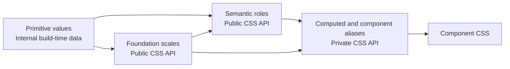
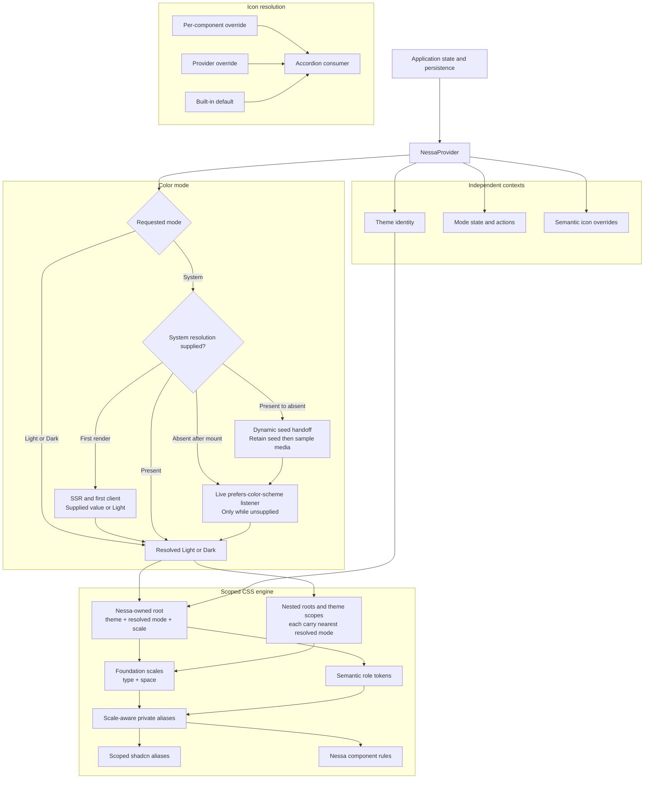

# Nessa Design System Core Contract

Status: **Normative guiding contract for all Nessa design-system work**  
Scope: `@nessa-ui/react`, the Nessa shadcn registry, Storybook, tests, and consumer documentation  
Persistence owner: consuming application  
Runtime baseline: React 19

This document defines the permanent design philosophy, architectural boundaries, and conformance requirements for Nessa components and supporting infrastructure. It is not authorization to implement a particular phase. Implementation work requires a separately approved plan, but every such plan and change must conform to this contract or explicitly amend it through architectural review.

The repository is still adopting this contract. Existing transitional code may not yet satisfy every invariant; the non-normative roadmap records that migration. New work must not deepen a known divergence, and a surface is not declared contract-conformant until its required verification passes.

## Goal

Give Nessa consumers one default provider for visual themes, color mode, and semantic internal icons while preserving clean boundaries for embedding, SSR, custom themes, and copied shadcn components.

```tsx
<NessaProvider>
  <App />
</NessaProvider>
```

Nessa owns presentation:

- public foundation scales, semantic tokens, and default Light/Dark values;
- a constrained, scoped UI scale that changes type and component geometry through CSS;
- session-only System-mode resolution when the application does not supply it;
- named and nested theme scopes;
- the Nessa-owned DOM scope carrying theme and resolved mode;
- semantic internal icon roles, defaults, and override resolution.

The application owns lifecycle and product concerns:

- persistence in cookies, storage, databases, or account settings;
- server-side preference lookup and first-paint strategy;
- document-level attributes outside the Nessa scope;
- integration with `next-themes`, Zustand, Redux, or another state manager;
- product illustrations and ordinary content icons.

## Governance and change conformance

This contract applies to every future Nessa component, theme, provider, package, registry item, Storybook surface, and supporting tool. A temporary implementation plan may sequence work but may not silently weaken or redefine this document.

Every nontrivial change must:

1. identify the applicable contract sections and public surfaces;
2. preserve package, registry, documentation, and Storybook parity where applicable;
3. provide automated evidence for machine-verifiable invariants;
4. receive an independent architecture review;
5. resolve every actionable finding before merge.

One-way decisions have stable identifiers in the normative contract index and are enforced by the repository `validation/` gate. Machine-verifiable rules run on every review; judgment-based rules require explicit reviewer evidence. The gate may sequence adoption through planned activation probes and exact temporary exceptions, but it may not silently weaken this contract.

Changing a normative rule requires an explicit contract amendment explaining the reason, compatibility impact, migration path, and verification changes. Code changes do not establish architectural precedent by themselves.

Independent review is a contribution practice, not a custom GitHub status. A
maintainer may use a qualified human or an isolated read-only agent review and
must resolve actionable findings before merge. When the repository has a
second eligible maintainer, standard GitHub approval protection may enforce
this practice without introducing a repository-owned approval publisher.

## Reference model and deliberate boundaries

Nessa combines established patterns without adopting another library's entire runtime:

- [shadcn theming](https://ui.shadcn.com/docs/theming): source ownership, semantic CSS variables, and application-owned font loading;
- [Radix Themes scaling](https://www.radix-ui.com/themes/docs/theme/spacing) and [typography](https://www.radix-ui.com/themes/docs/theme/typography): scoped/nested themes and a coordinated type/space scale;
- [Chakra tokens](https://chakra-ui.com/docs/theming/tokens): primitive-to-semantic token structure and generated artifacts;
- [MUI typography](https://mui.com/material-ui/customization/typography/): a complete appearance vocabulary and rem-based accessible typography, without adopting a runtime theme object;
- [Tailwind v4 compatibility](https://tailwindcss.com/docs/compatibility): the modern-browser floor used by Nessa's CSS arithmetic and registry output;
- [Tailwind dark mode](https://tailwindcss.com/docs/dark-mode) and [registry CSS rules](https://ui.shadcn.com/docs/registry/registry-item-json#css): why Nessa avoids redefining the host `dark` variant and how static helpers are delivered through the supported registry schema;
- [WCAG Resize Text](https://www.w3.org/WAI/WCAG22/Understanding/resize-text): zoom and reflow remain browser capabilities, not a substitute for Nessa scale presets.
- [WCAG Target Size Minimum](https://www.w3.org/WAI/WCAG22/Understanding/target-size-minimum.html): the 24 CSS-pixel floor and its narrow exceptions.
- [WCAG Contrast Minimum](https://www.w3.org/WAI/WCAG22/Understanding/contrast-minimum.html) and [Non-text Contrast](https://www.w3.org/WAI/WCAG22/Understanding/non-text-contrast.html): exact AA text, control, state, and focus thresholds.

Nessa does not adopt provider-owned persistence, runtime style injection, a deep JavaScript theme object, or document-root mutation. Translucent colors remain expressible as tokens, but a high-level translucency/panel axis waits until a real surface family establishes consistent semantics.

## Permanent contracts to freeze before implementation

### Token layering

Use four token layers. The distinction between public foundation values and public semantic roles is permanent: components must not couple their API to raw palette steps or generic Tailwind defaults.



#### Primitive values

Raw palettes and source measurements exist only in `packages/react/src/styles/tokens.ts` and generation code:

```ts
const primitives = {
  neutral: {
    50: "oklch(...)" ,
    900: "oklch(...)" ,
  },
}
```

Primitive names are not emitted as consumer CSS. Changing an internal palette or source scale therefore does not require a major release.

#### Public foundation scales

Publish namespaced, composable foundations instead of relying on the host application's generic Tailwind variables.

Typography uses coordinated levels. Each level is a size, line-height, and tracking contract rather than an isolated font-size value:

```css
--nessa-font-family-ui
--nessa-font-family-heading
--nessa-font-family-mono

--nessa-font-weight-regular
--nessa-font-weight-medium
--nessa-font-weight-semibold
--nessa-font-weight-bold

--nessa-font-size-1 /* through 7 */
--nessa-line-height-1 /* through 7 */
--nessa-letter-spacing-1 /* through 7 */
```

Use `rem` for font sizes, unitless values for line heights, and `em` for letter spacing. Seven levels are enough for the initial component and documentation surface; adding another level is additive.

Spacing is a public scale:

```css
--nessa-space-0 /* through 8 */
```

The application owns font delivery. Nessa supplies family stacks and variables but no `@font-face`, font binaries, or remote font requests. Storybook loads the documented default font explicitly. A consumer may point the family tokens at a local, hosted, or framework-managed font.

Consumer guidance prefers self-hosted or framework-managed loading where practical, appropriate preload for critical UI fonts, and an intentional `font-display` policy. It explains metric-compatible fallbacks plus `size-adjust` and related font metric descriptors when needed. Nessa does not promise zero layout shift—the application controls loading—but component geometry must remain usable, unclipped, and stable enough to interact with before the preferred font arrives.

#### Public semantic tokens

Semantic roles describe intent and remain public across themes:

```css
--nessa-color-background
--nessa-color-foreground
--nessa-color-surface
--nessa-color-surface-foreground
--nessa-color-popover
--nessa-color-popover-foreground
--nessa-color-primary
--nessa-color-primary-foreground
--nessa-color-secondary
--nessa-color-secondary-foreground
--nessa-color-muted
--nessa-color-muted-foreground
--nessa-color-accent
--nessa-color-accent-foreground
--nessa-color-destructive
--nessa-color-destructive-foreground
--nessa-color-border
--nessa-color-input
--nessa-color-focus
--nessa-control-height-sm
--nessa-control-height-md
--nessa-control-height-lg
--nessa-control-padding-inline-sm
--nessa-control-padding-inline-md
--nessa-control-padding-inline-lg
--nessa-icon-size-sm
--nessa-icon-size-md
--nessa-icon-size-lg
--nessa-radius-control
--nessa-radius-surface
--nessa-border-width-control
--nessa-focus-ring-width
--nessa-shadow-control
--nessa-shadow-surface
--nessa-motion-duration-instant
--nessa-motion-duration-fast
--nessa-motion-duration-normal
--nessa-motion-duration-slow
--nessa-motion-duration-ambient
--nessa-motion-easing-standard
--nessa-motion-easing-emphasized
--nessa-thinking-fill-base
--nessa-thinking-fill-current
--nessa-thinking-fill-highlight
--nessa-fast-mode-active
```

Surface and foreground pairs remain the color contract. Published Nessa themes provide every required semantic color for Light and Dark. Consumer-authored themes may override a subset and inherit the rest. Control dimensions and motion are semantic tokens, while public typography and spacing scales remain deliberately reusable foundations.

#### Private component aliases

Private aliases include scale-aware computed values and component-specific roles:

```css
--_nessa-font-size-2
--_nessa-space-3
--_nessa-control-height-md
--_nessa-dialog-overlay
--_nessa-button-background
```

The `--_nessa-*` prefix marks internal variables that are not semver-protected. Package CSS and generated `nessa-base` helper classes may consume them because those artifacts are built and released together. Copied registry component JSX must not name `--_nessa-*` directly: it consumes semver-protected generated class names. This prevents copied source from freezing private variable spellings while retaining the scale-aware live chain.

Registry items declare a dependency on the matching `nessa-base` item, and generation fails if a registry helper is absent from that base. Consumers may edit copied output, but Nessa does not promise compatibility for direct private-variable overrides. Promote a component alias to the public `--nessa-*` namespace only after a demonstrated consumer requirement.

### Low specificity and named cascade layers

The published CSS split is exact and prevents accidental Preflight ownership.

`theme.css` is generated, import-free, and owns the single layer-order declaration:

```css
@layer theme, base, nessa.tokens, nessa.components, components, utilities;
@layer nessa.tokens { /* tokens, aliases, scale, reduced motion */ }
```

`styles.css` imports the theme first, then only Tailwind's theme and utilities—never Preflight—and adds Nessa package component rules:

```css
@import "./theme.css";
@import "tailwindcss/theme.css" layer(theme);
@import "tailwindcss/utilities.css" layer(utilities);
@source "./components";
@layer nessa.components { /* static Nessa component helpers */ }
```

`app.css` is the explicitly opt-in application baseline:

```css
@import "./styles.css";
@import "tailwindcss/preflight.css" layer(base);
@layer base { /* Nessa application border/body baseline */ }
```

Rules:

- `theme.css` contains no `@import`, Preflight selector, or global body rule;
- `styles.css` contains no Preflight selector or global body rule;
- `app.css` is the only export that includes Preflight and Nessa's body baseline;
- `styles.css` and `app.css` receive their one layer-order declaration through the first `theme.css` import; they do not redeclare it;
- builds verify compiled layer order because first appearance determines cascade order;
- tokens live in `nessa.tokens`;
- compiled Nessa component rules live in `nessa.components`;
- registry installation cannot safely reorder a host's already-declared Tailwind layers, so its schema `css` payload maps the same zero-specificity token rules into the host's existing `base` layer and static helper selectors into `components`;
- this distribution-specific layer mapping preserves the same precedence—tokens before components, components before utilities—without injecting a new top-level layer after host `utilities`;
- token selectors use `:where()` so selector specificity is zero;
- no theming rule uses `!important`;
- package documentation directs reusable-library consumers to `styles.css`, token-only consumers to `theme.css`, and Nessa-owned apps that accept resets to `app.css`;
- unlayered consumer CSS wins over Nessa defaults;
- consumers using layers place their override layer after the Nessa layers.

Compiled assertions cover all three package exports and the registry payload independently. They fail on an unexpected universal reset, heading/form reset, `body` rule, duplicate package layer-order declaration, or a package/registry rule in the wrong declared layer.

### Exact theme selector and fallback contract

Every Nessa root receives Default tokens even when `theme` is unknown. Unknown roots never become unstyled. Unknown nested themes inherit every public foundation and semantic token from their nearest parent. A partial known/custom theme inherits omitted values.

An explicit nested `theme="default"` resets every theme-owned public foundation and semantic token—colors, font families/type ramp, spacing, control geometry, radii, borders, shadows, and motion—to Nessa Default. It does not reset inherited scale unless that scope also supplies `scale`. Published Nessa themes are complete across every category designated theme-owned.

Generated CSS uses the minimal selectors below:

```css
@layer nessa.tokens {
  :where([data-nessa-root]),
  :where([data-nessa-theme="default"]) {
    /* Complete Default Light foundation and semantic values. */
  }

  :where([data-nessa-root][data-nessa-mode="dark"]),
  :where(
    [data-nessa-theme="default"][data-nessa-mode="dark"]
  ) {
    /* Complete Default Dark color values. Non-color defaults also reset above. */
  }

  :where([data-nessa-theme="brand"]) {
    /* Brand Light overrides. */
  }

  :where(
    [data-nessa-mode="dark"][data-nessa-theme="brand"]
  ) {
    /* Brand Dark overrides. */
  }
}
```

Every theme-bearing `NessaThemeScope` emits its current resolved `data-nessa-mode` by consuming only `NessaColorModeContext`; a scale-only scope does not need the attribute. Dark token selectors match attributes on the same scope element and never use an arbitrary Dark ancestor. This makes the nearest Nessa root/theme scope authoritative and allows nested providers to resolve independently in both Dark → Light and Light → Dark directions. Redundant descendant and root-plus-theme Light selectors are not generated.

Generator source order is load-bearing and frozen. Package `theme.css` emits:

1. the single package layer-order declaration, with no imports;
2. complete Default Light foundations/semantics;
3. named Light theme overrides in canonical theme-name order;
4. Default Dark color overrides;
5. named Dark overrides in the same canonical order;
6. scale factors and locally recomputed aliases;
7. shadcn color bridge;
8. reduced-motion overrides last.

The registry `css` payload emits the same token/alias order inside host `base`, with reduced motion last inside that layer, followed by static `nessa-*` helpers inside host `components`. Package `styles.css`/`app.css` import order is authored exactly as specified in the CSS split and is verified after compilation.

Generation and compiled-CSS tests assert this ordering; stable sorting alone is insufficient.

### Supported consumer override surface

Public tokens are redeclared on Nessa-owned scopes, so inherited `:root` values intentionally do not override Nessa defaults. Consumers place overrides on the actual Nessa root/theme scope, either unlayered or in a layer declared after `nessa.tokens`:

```css
[data-nessa-root].acme-theme,
[data-nessa-theme="acme"] {
  --nessa-color-primary: oklch(...);
  --nessa-font-family-ui: "Acme Sans", sans-serif;
}
```

The provider can receive the targeting class through `className="acme-theme"`. Documentation explicitly warns that `:root { --nessa-* }` is unsupported and is silently shadowed by declarations on the Nessa scope. Fixtures prove the supported scope override works, while a `:root`-only override does not change Nessa computed styles.

### Exact meaning of `data-nessa-mode`

`data-nessa-mode` always stores the resolved visual appearance:

```html
data-nessa-mode="light"
data-nessa-mode="dark"
```

It never stores `system`. Requested System mode stays in React state while `resolvedMode` becomes Light or Dark. The wrapper may derive a scoped `dark` class for shadcn/Tailwind compatibility, but `data-nessa-mode` is Nessa's canonical DOM contract.

Nessa does not register or redefine Tailwind's compiler-global `dark` variant, and Nessa-owned package/registry components do not use `dark:*` for visual behavior. Every Light/Dark difference—including invalid rings—is represented by a semantic token overridden on the same mode-bearing scope. This avoids OS-query drift, host variant conflicts, and Dark ancestors leaking through nested Light providers. The derived `.dark` compatibility class is removed from the permanent provider contract.

### Typography, font delivery, and responsive behavior

Typography is CSS-first. React context carries no font family, type ramp, breakpoint, or computed style values.

- Nessa components use the coordinated namespaced typography levels, never bare `text-sm` or an unbridged host theme variable.
- The default body role uses the UI family; heading roles use the heading family; code roles use the mono family.
- Font loading is application-owned. Nessa documentation shows how to install/load the default Geist family and how to replace it.
- Components remain usable with the fallback stack and do not assume a particular font's metrics.
- Responsive typography is expressed in CSS, using media or container queries only when a component demonstrates a need. There is no JavaScript breakpoint context.
- Below the frozen `48rem` mobile viewport threshold, Input uses `font-size: max(1rem, var(--_nessa-font-size-input))`; at `48rem` and above it uses the active coordinated/scaled input token without the floor. The package and registry emit the same viewport media query, never a touch-capability query. Narrow viewports therefore avoid focus zoom while desktop `90`/`95` scale may retain compact type.

Before public release, migrate the existing `--nessa-font-sans` and `--nessa-font-mono` draft names to `--nessa-font-family-ui` and `--nessa-font-family-mono`. Do not keep two independently configurable aliases for the same role.

### Constrained UI scale

Runtime UI sizing is a day-one theme capability, but it is a finite visual preset rather than an arbitrary numeric multiplier:

```ts
export const NessaScale = {
  Smaller: "90",
  Small: "95",
  Default: "100",
  Large: "105",
  Larger: "110",
  Largest: "125",
} as const

export type NessaScale =
  (typeof NessaScale)[keyof typeof NessaScale]
```

`NessaProvider` and `NessaThemeScope` accept `scale?: NessaScale`. The root provider always emits `data-nessa-scale`, defaulting to `100`. A nested `NessaThemeScope` emits the attribute only when its `scale` prop is supplied: a theme-only scope inherits scale, while a scale-only or theme-plus-scale scope sets an absolute scale rather than multiplying its parent. The scale is an attribute/CSS contract only; it does not create a fourth React context or a scale hook.

Scale affects:

- font sizes; unitless line-height ratios stay stable so the physical line box scales exactly once with the font;
- spacing values used by components;
- control heights and inline padding;
- semantic icon dimensions.

Scale does not affect:

- colors, opacity, or color mode;
- radii, border widths, or focus-ring thickness;
- shadows or z-index;
- motion duration/easing;
- hit-target accessibility floors.

Do not implement scale with CSS `zoom`, transforms, or mutation of `html`/wrapper `font-size`. Use the same modern CSS arithmetic baseline as Tailwind CSS v4: Chrome 111+, Safari 16.4+, and Firefox 128+. The Vite, Next, registry, and browser fixtures gate this contract. A private factor keeps nested scale and later consumer baseline overrides composable without a selector cross-product:

```css
/* The zero-specificity baseline must precede the presets: on the root
   provider, which carries data-nessa-root and data-nessa-scale together,
   the preset wins purely by source order. */
:where(:root, [data-nessa-root]) { --_nessa-scale-factor: 1; }

:where([data-nessa-scale="90"]) { --_nessa-scale-factor: 0.9; }
:where([data-nessa-scale="95"]) { --_nessa-scale-factor: 0.95; }
:where([data-nessa-scale="100"]) { --_nessa-scale-factor: 1; }
:where([data-nessa-scale="105"]) { --_nessa-scale-factor: 1.05; }
:where([data-nessa-scale="110"]) { --_nessa-scale-factor: 1.1; }
:where([data-nessa-scale="125"]) { --_nessa-scale-factor: 1.25; }

:where(
  :root,
  [data-nessa-root],
  [data-nessa-theme],
  [data-nessa-scale]
) {
  --_nessa-font-size-2:
    calc(var(--nessa-font-size-2) * var(--_nessa-scale-factor));
  --_nessa-line-height-2: var(--nessa-line-height-2);
  --_nessa-letter-spacing-2: var(--nessa-letter-spacing-2);
}
```

Geometry does not need a bespoke token ramp. Tailwind CSS v4 derives every
spacing and sizing utility from a single `--spacing` base and resolves the
variable at the element that uses the utility, so redeclaring that base per
scope carries padding, gaps, control heights, and spacing-derived icon sizes
through the same factor as type:

```css
:root,
:where(
  [data-nessa-root],
  [data-nessa-theme],
  [data-nessa-scale]
) {
  --spacing: calc(0.25rem * var(--_nessa-scale-factor));
}
```

The bare `:root` (not `:where`) outranks Tailwind's own `:root, :host`
declaration earlier in the shared theme layer. Radii, border widths, focus
rings, and motion keep their own tokens and never resolve through
`--spacing`. A dimension that must stay absolute under scale — a hairline, a
focus ring, a border — is expressed as an arbitrary px value precisely
because those opt out of the spacing base.

These computed aliases are redeclared at every root, theme, and scale scope. This is necessary because an inherited custom property may otherwise retain the value computed against its parent's tokens. Theme overrides and nested scale changes always recompute locally while retaining consumer-overridden baselines.

Public typography sizes, spacing, control heights/padding, and icon sizes describe the `100`-scale baseline. Active scale is applied after consumer overrides through the private computed aliases. Public unitless line-height ratios are direct private aliases and are never multiplied by scale. Consumers needing an exact final rendered dimension override component CSS; a public baseline token intentionally continues through the active scale contract.

Scale is not density. A future density axis may alter whitespace/control compactness without changing text. Do not add density until real compact-layout requirements establish its semantics.

TOKEN-004 enforces both axes of this contract: the seven coordinated levels, the private computed aliases, the six preset factors, the `nessa-text-*` helpers that Nessa-owned components name instead of a Tailwind size utility, and the `--spacing` redeclaration that carries geometry through the same factor. A descendant selector that cannot carry a helper class sizes in `em` so it continues to follow the active scale.

### Styling discipline and inline-style escape hatch

Component styling stays inside the semantic token system, with one narrow, exactly-ledgered escape hatch for values that only exist at runtime. Three invariants make styling-at-a-distance and token bypasses structurally difficult rather than merely discouraged:

1. **Semantic color only (STYLE-001).** Class surfaces (`className`, `cn`, `cva`) never use raw Tailwind palette scales (`bg-red-500`, `text-zinc-400`) or literal color values in arbitrary utilities — hex, color constructors, and named colors alike (`bg-[#fff]`, `text-[oklch(...)]`, `bg-[red]`), including paint-setting arbitrary properties (`[color:red]`, `[background:linear-gradient(...,red,...)]`). Every color routes through a semantic token utility or a `--nessa-*` custom property, so a palette or theme change is a token edit, never a component sweep. `color-mix()` and `light-dark()` over token references are token-preserving and stay allowed, as are the token-neutral keywords (`transparent`, `currentColor`, `inherit`); a literal color constructor inside them is still a violation. This invariant has no exception ledger: a new raw color in a class surface is always a contract violation.
2. **Frozen stacking scale (STYLE-002).** Class-surface z-index utilities are limited to `z-0`, `z-10`, `z-20`, `z-30`, `z-40`, `z-50`, and `z-auto`. Arbitrary, negative, variable, or arbitrary-property forms (`z-[60]`, `z-[1]`, `-z-10`, `z-(--layer)`, `[z-index:...]`) are off-scale violations. The ledger currently holds no stacking exceptions and should stay that way: local orderings inside a stacking context express themselves on the scale (`z-10` beats `z-auto` exactly as `z-[1]` did), and `z-50` is the repository-wide overlay ceiling — nothing stacks above it, so "one higher" is never a reason.
3. **Inline styles are computed geometry only (STYLE-003).** Properties declared through the JSX `style` attribute are limited to CSS custom properties (`--*`) and a frozen allowlist of runtime-geometry properties: inset/position (`left`, `top`, `insetInlineStart`, …), sizing (`width`, `maxHeight`, `flexBasis`, …), transforms (`transform`, `translate`, `rotate`, `scale`, `transformOrigin`, `transformBox`), and `opacity`. Anything else — paint, spacing, layering, motion — either becomes a utility fed by a custom property or is an exact ledgered exception. Two hardenings keep the escape hatch auditable: dynamically keyed style properties (`{[key]: value}` with a non-literal key) are violations outright, and an inline custom property whose literal value embeds a raw color (`"--x": "#f00"`) is an exact ledgered exception rather than a free pass. Static values that a utility can express never belong in `style`.

Categorical chart colour follows the same rule through a dedicated ramp of `--nessa-chart-series-*` tokens: the hues live in the token chain, and a chart chooses which step of the ramp its mark type calls for rather than naming a colour. What the ramp is, why its slot order is load-bearing, and the series budget that order buys are documented in [chart series ramp](./chart-series-ramp.md).

The exception ledger is exact: each entry pins one file, one needle, and a maximum occurrence count, and the checker fails when an occurrence drifts in either direction. Genuinely runtime-computed surfaces (generated gradients, measured gaps, cascade-derived layering) remain expressible, but every such site is visible, counted, and carries its own removal condition.

The checker resolves class strings and style objects statically — through const/let bindings in scope, template literals, conditionals, spreads, `useMemo`/`useCallback` results, and object-map lookups. Values it cannot resolve (results of other calls, imported style objects, prop-driven passthrough) are outside its reach; these invariants still govern such code through review, and resolver coverage may only widen, never narrow.

### Motion and reduced motion

Motion is token-driven CSS, not provider state. Components use duration/easing semantic tokens, and CSS owns the accessibility fallback:

```css
@media (prefers-reduced-motion: reduce) {
  :root,
  :where(
    [data-nessa-root],
    [data-nessa-theme],
    [data-nessa-scale]
  ) {
    --nessa-motion-duration-fast: 0ms;
    --nessa-motion-duration-normal: 0ms;
    --nessa-motion-duration-slow: 0ms;
    --nessa-motion-duration-ambient: 0ms;
  }
}
```

Essential state changes remain understandable without animation. There is no `motion` provider prop in the foundation.

### Interaction geometry stability

ModelPicker hover, focus, and pointer preview must not resize or reposition the
model-option surface that produced the interaction. Preview-specific auxiliary
content must reserve stable geometry or render on an independently positioned
surface. Model capabilities remain separate, application-composed controls and
must not be mounted in response to model-row preview.

Thinking levels are an ordered, consumer-supplied catalog. The slider derives
its detents, labels, and proportional positions from that catalog, supports
continuous pointer preview between detents, and commits the nearest level on
release. Crossing a level midpoint updates the visible label and invokes the
optional checkpoint callback. Keyboard movement stays discrete and mirrors
horizontal direction in RTL. The `accent: "ultra"` field opts into the maximum
stream treatment without hard-coding a label or catalog length.

The filled range owns a constant semantic gradient. A separate, low-opacity
horizontal sheen moves continuously from right to left, with ordinal energy
increasing by level and an optional bounded Fast-mode speed multiplier. Reduced
motion disables ambient and checkpoint motion while preserving state. The
composed Ultra popover uses a restrained semantic violet shader; Fast mode keeps
its transparent hit target and communicates activation through the icon alone.

ChatComposer remains intrinsically shrinkable. Its footer action groups may
wrap as units, its input owns overflow under a whole-composer height cap, and
the footer remains visible. ModelPicker uses one searchable model list and a
provider tab rail with stable accessible names, complete Home/End and
direction-aware arrow navigation, and one reachable tab stop.

### Accessibility and rendering invariants

- Browser zoom to 200% preserves reflow and text readability; Nessa never suppresses browser zoom.
- Button (every size) and Accordion trigger retain at least a 24 by 24 CSS-pixel target at scale `90`; Input retains at least 24 CSS pixels of height. Scaled control aliases enforce these floors with `max()`.
- Icon-only Button retains at least 32 by 32 CSS pixels at scale `90`. Nessa documents 44 by 44 as an optional enhanced touch target, not a foundation guarantee.
- WCAG Target Size exceptions are limited to inline text, an equivalent nearby control, user-agent-owned controls, or an essential presentation; a Nessa component may use one only when its API/docs and accessibility test identify the exception explicitly.
- Focus-ring thickness and contrast do not shrink with scale.
- Every Nessa-published Light/Dark theme meets WCAG 2.2 AA: normal text is at least 4.5:1; large text is at least 3:1 under WCAG's size/weight definition; required non-text boundaries, states, and focus indicators are at least 3:1 against adjacent colors where the criterion applies. Canonical token pairs are checked automatically.
- Disabled/inactive controls follow WCAG's contrast exemption, but a state users must perceive is not communicated through color or opacity alone. Consumer-authored themes own their own contrast compliance.
- Forced-colors mode retains visible controls, state, and focus indication.
- Custom fonts are not required for layout correctness.
- Alpha/translucent surface values may be expressed as color tokens, but there is no translucency provider axis.
- z-index tokens and portal ownership are deferred until the first portal component defines real stacking requirements.

### Icon ownership

Icon components use `currentColor` and forward standard SVG props, `className`, and React 19 `ref` props.

The icon family owns:

- path artwork and viewbox;
- stroke-versus-fill treatment;
- the visual character of its strokes.

The consuming Nessa component owns:

- rendered size and semantic color;
- hit-target dimensions;
- animation and component state;
- `aria-hidden="true"` and `focusable="false"` for decorative icons;
- the accessible name on an icon-only control.

Provider definitions never contain localized labels or global sizing.

Resolution order is:

1. Per-component icon prop.
2. Nearest `NessaIconProvider` override.
3. Parent provider override.
4. Tiny built-in `currentColor` default.

### Independent and stable contexts

Use three contexts:

- `NessaThemeContext`: theme identity and scope metadata;
- `NessaColorModeContext`: requested mode, resolved mode, and `setMode`;
- `NessaIconContext`: merged semantic icon overrides.

Ordinary CSS-driven components consume none of these merely to obtain visual values. Provider values are memoized, setters use `useCallback`, and nested icon maps merge through `useMemo`.

Do not add context selectors or an external store until profiling demonstrates a need.

### Root wrapper and `asChild`

`NessaProvider` renders one Nessa-owned `div` by default:

```html
<div
  data-nessa-root
  data-nessa-theme="default"
  data-nessa-mode="dark"
  data-nessa-scale="100"
  style="color-scheme: dark"
>
```

The wrapper:

- is the only DOM surface Nessa mutates;
- never mutates `documentElement` or `body`;
- applies no layout rules;
- accepts `className`, `style`, and a React 19 `ref` prop;
- documents that a default block wrapper can affect direct-child flex/grid selectors.

`asChild` is recommended when the application already owns its root element:

```tsx
<NessaProvider asChild>
  <main className="min-h-screen">
    <App />
  </main>
</NessaProvider>
```

`asChild` requires one DOM-capable `ReactElement`. Text, arrays, and multiple children fail the type contract. A development guard rejects Fragments. Consumer classes merge with Nessa classes; consumer styles merge while Nessa retains ownership of `colorScheme`. Nessa-owned attributes win. Existing `data-nessa-*` attributes produce a development warning. `NessaThemeScope` follows the same ownership rules.

### Deterministic generated artifacts

`packages/react/src/styles/tokens.ts` is canonical. `registry.source.ts` is the authored registry manifest and imports token data. `scripts/generate-theme-artifacts.ts` produces committed artifacts:

- `packages/react/src/theme.css`;
- `packages/react/src/styles/registry-base.generated.css`;
- `registry.json`.

Generation guarantees:

- stable key ordering, whitespace, and line endings;
- no timestamps, absolute paths, or locale-sensitive sorting;
- generated-file headers;
- file-specific emission: import-free package `theme.css`, registry tokens/helpers mapped to host `base`/`components`, and a schema-valid equivalent `registry.json.items[].css` payload;
- atomic in-place writes for `pnpm generate`.

`pnpm check:generated` generates in memory or a temporary directory, compares byte-for-byte, reports drift, exits nonzero, and never changes the working tree. Package and registry builds run `check:generated`; they do not silently repair drift.

### One live token chain for package and registry

Package component CSS references namespaced public tokens or private computed aliases directly:

```css
.nessa-button {
  background: var(--nessa-color-primary);
  color: var(--nessa-color-primary-foreground);
  min-height: var(--_nessa-control-height-md);
  padding-inline: var(--_nessa-control-padding-inline-md);
  font-size: var(--_nessa-font-size-2);
  line-height: var(--_nessa-line-height-2);
}
```

Copied shadcn components continue using semantic color classes such as `bg-primary`. `nessa-base` installs only this exact scoped interoperability allowlist on every root and nested theme/scale scope:

| shadcn variable | Nessa public token |
| --- | --- |
| `--background` | `--nessa-color-background` |
| `--foreground` | `--nessa-color-foreground` |
| `--card` | `--nessa-color-surface` |
| `--card-foreground` | `--nessa-color-surface-foreground` |
| `--popover` | `--nessa-color-popover` |
| `--popover-foreground` | `--nessa-color-popover-foreground` |
| `--primary` | `--nessa-color-primary` |
| `--primary-foreground` | `--nessa-color-primary-foreground` |
| `--secondary` | `--nessa-color-secondary` |
| `--secondary-foreground` | `--nessa-color-secondary-foreground` |
| `--muted` | `--nessa-color-muted` |
| `--muted-foreground` | `--nessa-color-muted-foreground` |
| `--accent` | `--nessa-color-accent` |
| `--accent-foreground` | `--nessa-color-accent-foreground` |
| `--destructive` | `--nessa-color-destructive` |
| `--destructive-foreground` | `--nessa-color-destructive-foreground` |
| `--border` | `--nessa-color-border` |
| `--input` | `--nessa-color-input` |
| `--ring` | `--nessa-color-focus` |

```css
@layer nessa.tokens {
  :where(
    [data-nessa-root],
    [data-nessa-theme],
    [data-nessa-scale]
  ) {
    --primary: var(--nessa-color-primary);
    --primary-foreground:
      var(--nessa-color-primary-foreground);
    --background: var(--nessa-color-background);
    --foreground: var(--nessa-color-foreground);
  }
}
```

Color aliases are redeclared at every root/theme/scale scope so they recompute against that scope's namespaced values. Host shadcn variables outside the Nessa scope remain untouched.

Registry component source uses generated namespaced static helper classes from `nessa-base`. This is the chosen readable/stable contract; registry JSX does not use arbitrary private-variable values or Tailwind `@utility` declarations:

```tsx
className={cn(
  "nessa-text-2",
  "nessa-min-h-control-md",
  "nessa-px-control-md",
)}
```

The generated registry CSS places these selectors in the host's existing `@layer components`; the package equivalent lives in `nessa.components`:

```css
@layer components {
  .nessa-text-2 {
    font-size: var(--_nessa-font-size-2);
    line-height: var(--_nessa-line-height-2);
    letter-spacing: var(--_nessa-letter-spacing-2);
  }

  .nessa-min-h-control-md {
    min-height: var(--_nessa-control-height-md);
  }
}
```

`nessa-text-2` applies the coordinated font-size, unitless line-height, and tracking aliases. Geometry helpers use `min-height`, never a fixed height, so text zoom, fallback fonts, and translated content may grow. Application Tailwind utilities live later in `utilities` and can override Nessa helpers predictably. Helper class names and meanings used by published registry items are semver-protected; their private implementation variables are not.

Do not remap generic `--spacing`, `--text-*`, radius, shadow, or motion variables on a Nessa root: doing so would retheme unrelated application-authored Tailwind content. Package and copied registry components must not obtain promised typography, spacing, radius, shadow, or motion behavior from an unscoped host default.

The generator audits compiled registry component classes. It allows exactly the semantic-color table above, including deliberate `card` → `surface` and `ring` → `focus` mappings; fails on any unlisted generic theme dependency; verifies every registry-used `nessa-*` helper exists in the registry `components` payload and package `nessa.components` output; and rejects generic Tailwind type/spacing/radius/shadow/motion dependencies. This is a focused shadcn color bridge, not permission to mirror the consumer's entire Tailwind theme.

Browser tests verify computed styles for package and copied registry components under Default Light/Dark, all six scale presets, nested custom themes/scales, nested Default resets, custom font overrides, and host content outside Nessa.

## Simplified color-mode API

There is no `Managed`/`External` strategy discriminant. Controlled mode already covers external state managers.

```ts
export const NessaColorMode = {
  Light: "light",
  Dark: "dark",
  System: "system",
} as const

export type NessaColorMode =
  (typeof NessaColorMode)[keyof typeof NessaColorMode]

export type NessaResolvedColorMode =
  | typeof NessaColorMode.Light
  | typeof NessaColorMode.Dark

export type NessaControlledColorMode = {
  mode: NessaColorMode
  resolvedMode?: NessaResolvedColorMode
  onModeChange: (mode: NessaColorMode) => void
  defaultMode?: never
  defaultResolvedMode?: never
}

export type NessaUncontrolledColorMode = {
  mode?: never
  resolvedMode?: never
  defaultMode?: NessaColorMode
  defaultResolvedMode?: NessaResolvedColorMode
  onModeChange?: (mode: NessaColorMode) => void
}
```

Resolution:

1. Controlled Light resolves Light.
2. Controlled Dark resolves Dark.
3. Controlled System with `resolvedMode` uses the application value and does not register `matchMedia`.
4. Controlled System without `resolvedMode` renders Light on the server and first client render, then resolves through `matchMedia` after hydration.
5. Uncontrolled explicit mode resolves directly.
6. Uncontrolled System uses `defaultResolvedMode` for the server and first client render, falling back to Light, then resolves through `matchMedia`.

The public shapes intentionally accept variables typed as the full `NessaColorMode` union, which is the normal external-store integration. `resolvedMode` is meaningful only when controlled `mode` is System; `defaultResolvedMode` is meaningful only when the initial uncontrolled `defaultMode` is System. Explicit modes ignore the corresponding resolution prop and warn in development.

`resolvedMode` presence is fully dynamic while controlled System remains selected:

- absent → present: render the supplied value immediately and unregister any Nessa media listener;
- present → absent after mount: retain the last supplied resolution for that transition render, register and synchronously sample `matchMedia` in the effect, then follow OS changes;
- present on the server/first client render → absent in a later application effect: this is the supported server-seed-to-Nessa handoff and avoids a Light flash;
- an application must keep its server-supplied value stable through the first hydration render; changing it before hydration is an application mismatch, not something Nessa can repair.

Every transition is frozen:

- entering unsupplied System after mount—from controlled explicit mode, uncontrolled `setMode(System)`, or a later re-entry—retains the last committed resolved appearance for the transition render, then samples/subscribes to `matchMedia`;
- leaving System for explicit Light/Dark resolves that value immediately, removes the listener, and invalidates queued media events;
- re-entering System never reuses `defaultResolvedMode`; defaults are initial-state inputs only;
- changing `defaultMode` or `defaultResolvedMode` after mount has no effect.

Each listener owns a monotonically increasing generation. A media event may commit only while the provider is mounted, its generation is current, mode is still unsupplied System, and no application `resolvedMode` is present. Cleanup/non-System/supplied transitions invalidate the generation before stale callbacks can commit. Switching between controlled-System supplied/unsupplied submodes is supported and does not trigger the controlled/uncontrolled warning.

Nessa never persists mode. Applications connect persistence through controlled props.

```tsx
<NessaProvider
  mode={applicationMode}
  resolvedMode={applicationResolvedMode}
  onModeChange={persistApplicationMode}
>
  <App />
</NessaProvider>
```

## Theme names

Theme names are extensible strings, not branded values:

```ts
export const NessaTheme = {
  Default: "default",
} as const

export type KnownNessaTheme =
  (typeof NessaTheme)[keyof typeof NessaTheme]

export type NessaThemeName =
  | KnownNessaTheme
  | (string & {})
```

Known names are generated from canonical theme definitions for autocomplete. Custom applications use plain strings:

```tsx
<NessaThemeScope theme="acme-marketing">
  <PricingCard />
</NessaThemeScope>
```

The fallback contract prevents a typo from producing an unthemed tree. There is no `defineNessaThemeName` helper.

## React 19 public API

Refs are ordinary props; public types do not expose `ForwardRefExoticComponent`.

```ts
export type NessaIconProps =
  Omit<React.ComponentPropsWithRef<"svg">, "children"> & {
    size?: number | string
  }

export type NessaIconComponent = (
  props: NessaIconProps,
) => React.ReactNode

export type NessaIconRole =
  | "check"
  | "close"
  | "chevronDown"
  | "chevronUp"
  | "chevronLeft"
  | "chevronRight"
  | "moreHorizontal"

export type NessaIconOverrides = Partial<
  Record<NessaIconRole, NessaIconComponent>
>

export interface NessaColorModeState {
  mode: NessaColorMode
  resolvedMode: NessaResolvedColorMode
  setMode: (mode: NessaColorMode) => void
}

export function useNessaColorMode(): NessaColorModeState

export interface NessaIconProviderProps {
  icons?: NessaIconOverrides
  children: React.ReactNode
}

export function NessaIconProvider(
  props: NessaIconProviderProps,
): React.ReactElement

export function useNessaIcon(
  role: NessaIconRole,
): NessaIconComponent

type NessaRootSharedProps = {
  theme?: NessaThemeName
  scale?: NessaScale
  icons?: NessaIconOverrides
  className?: string
  style?: React.CSSProperties
  ref?: React.Ref<HTMLElement>
}

type NessaRootElementProps =
  | {
      asChild: true
      children: React.ReactElement
    }
  | {
      asChild?: false
      children: React.ReactNode
    }

export type NessaProviderProps =
  & NessaRootSharedProps
  & NessaRootElementProps
  & (NessaControlledColorMode | NessaUncontrolledColorMode)

export function NessaProvider(
  props: NessaProviderProps,
): React.ReactElement

type NessaThemeScopeSelection =
  | { theme: NessaThemeName; scale?: NessaScale }
  | { theme?: never; scale: NessaScale }

export type NessaThemeScopeProps =
  & NessaThemeScopeSelection
  & {
      className?: string
      style?: React.CSSProperties
      ref?: React.Ref<HTMLElement>
    }
  & NessaRootElementProps

export function NessaThemeScope(
  props: NessaThemeScopeProps,
): React.ReactElement
```

`useNessaColorMode` and `NessaThemeScope` throw a clear development error outside `NessaProvider`; a theme scope needs the provider's resolved mode to maintain root-boundary-safe selectors. `useNessaIcon` always resolves through a provider or built-in default and never returns `undefined`. Switching between controlled and uncontrolled mode after mount warns in development.

The server helper remains browser-free:

```ts
export interface NessaThemeAttributeInput {
  theme: NessaThemeName
  resolvedMode: NessaResolvedColorMode
  scale?: NessaScale
}

export interface NessaThemeAttributes {
  "data-nessa-root": ""
  "data-nessa-theme": string
  "data-nessa-mode": NessaResolvedColorMode
  "data-nessa-scale": NessaScale
  style: { colorScheme: NessaResolvedColorMode }
}

export function getNessaThemeAttributes(
  input: NessaThemeAttributeInput,
): NessaThemeAttributes
```

The helper returns Nessa-owned attributes, not a premerged consumer prop bag. Documentation shows explicit style merging so `colorScheme` remains Nessa-owned:

```tsx
const {
  style: nessaStyle,
  ...nessaAttributes
} = getNessaThemeAttributes(input)

<div
  {...nessaAttributes}
  className="application-shell"
  style={{ ...applicationStyle, ...nessaStyle }}
/>
```

## Root exports and build shape

All client and presentational public APIs are available from the root:

```tsx
import {
  Button,
  NessaProvider,
  NessaThemeScope,
  NessaIconProvider,
  NessaColorMode,
  NessaScale,
} from "@nessa-ui/react"
```

Only the explicitly server-safe helper uses a subpath:

```tsx
import {
  getNessaThemeAttributes,
} from "@nessa-ui/react/theme/server"
```

CSS exports remain:

```text
@nessa-ui/react/styles.css
@nessa-ui/react/theme.css
@nessa-ui/react/app.css
```

Build per file with `bundle: false`. Compile every `src/**/*.ts` and `src/**/*.tsx` module so internal relative imports remain available. Each hook/provider module preserves its own `"use client"` directive. The root index re-exports public APIs but is not collapsed into one client-only bundle.

Package exports are limited to:

```text
.
./theme/server
./styles.css
./theme.css
./app.css
```

A Next App Router fixture must prove that a Server Component can import presentational components from the root and a client boundary can import `NessaProvider` from the same root.

### The parser package

`@nessa-ui/agent-stream` is published beside `@nessa-ui/react` and converts an
agent CLI's bytes into a normalized event log. It renders nothing, so it
declares no dependencies, no optional or bundled dependencies, and no peer
dependencies, imports React through no spelling, and carries no `"use client"`
directive. A Node process, a Server Component, or a non-React host must be able
to consume it; anything that reintroduces the framework makes that false.

Package exports are limited to:

```text
.
./transcript
```

The split is the layering, not a convenience. The root entry carries the wire
and mapper layers and stops at the agent message; the optional fold — turns,
tool groups, delegated runs — is reached only through `./transcript`. The root
entry must not reach the fold, by re-export or through any transitive relative
import: the fold's two modules import each other's values, and
`@nessa-ui/react` re-exports both entries with `export *`, where a name carried
by both is ambiguous and is elided silently rather than reported.

`@nessa-ui/react` re-exports both entries, so its own public surface is
unchanged and a React host needs no migration.

## Real icon consumer before API stability

The icon provider is provisional until a real Nessa component consumes it. A story-only hook harness is necessary but insufficient.

Add Accordion in the same foundation milestone:

- it consumes the `chevronDown` semantic role;
- its component-level indicator override outranks provider defaults;
- it tests `currentColor`, sizing, state rotation, refs, and accessibility;
- it requires no portal contract.

The icon API becomes semver-stable only after package and registry Accordion variants pass consumer tests.

## Target architecture



## Wire parsing discipline

Nessa ships parsers for coding-agent output streams, which read untrusted bytes
from a third-party CLI whose shapes change between releases. Three invariants
keep that surface honest, and they are contracts rather than conventions
because each one fails silently when it is broken.

1. **Wire vocabularies are frozen objects with derived unions, never
   TypeScript enums (PARSE-001).** An `enum` is a nominal type that does not
   survive JSON: a value decoded from a wire could never *be* one without a
   cast, so the naming that was supposed to add safety adds a cast instead. A
   frozen object with a derived union gives the same autocomplete and
   exhaustiveness checking while its values remain the literals the wire
   actually carries.
2. **Exported vocabularies are frozen at runtime, not only at compile time
   (PARSE-002).** `as const` and `satisfies` describe a literal without
   changing what it is, so an exported vocabulary a consumer can mutate is a
   shared global anyone can corrupt.
3. **Values decoded from a wire are narrowed through the shared readers, never
   by hand (PARSE-003).** Everything past `JSON.parse` is unknown at runtime —
   a declared type is a claim about the bytes, not a check on them — so
   narrowing happens once, behind names, in one module. Scattered `typeof`
   comparisons are the failure this forbids: they drift, they disagree, and
   each one is a place a malformed line becomes a crash or a wrong value
   instead of an absent one.

The parsers themselves, and what the wire actually contains, are documented in
[agent stream parsers](./agent-stream-parsers.md); this section governs only
the discipline the gate enforces.

## Canonical source and generated files

```text
packages/react/
├── src/
│   ├── provider/
│   │   └── nessa-provider.tsx
│   ├── theme/
│   │   ├── server.ts
│   │   ├── color-mode.ts
│   │   ├── theme-context.tsx
│   │   ├── theme-scope.tsx
│   │   ├── theme-attributes.ts
│   │   ├── themes.ts
│   │   └── use-color-mode.ts
│   ├── icons/
│   │   ├── default-icons.tsx
│   │   ├── icon-provider.tsx
│   │   ├── icon-registry.ts
│   │   └── use-icon.ts
│   ├── styles/
│   │   ├── tokens.ts
│   │   └── registry-base.generated.css
│   ├── components/
│   │   └── accordion.tsx
│   ├── app.css
│   ├── styles.css
│   ├── theme.css  # committed generated, import-free
│   └── index.ts
├── test/
│   ├── color-mode-provider.test.tsx
│   ├── icon-provider.test.tsx
│   ├── theme-scope.test.tsx
│   ├── accordion.test.tsx
│   └── setup.ts
├── tsup.config.ts
└── vitest.config.ts

packages/agent-stream/          # published, framework-free; renders nothing
├── src/
│   ├── index.ts                # the contract entry — stops at the agent message
│   ├── events.ts               # AgentEvent and the shared payload union
│   ├── json.ts                 # the narrowing readers every wire value passes
│   ├── transcript/             # the optional fold, reached only via "./transcript"
│   │   ├── index.ts
│   │   ├── fold.ts
│   │   └── builder.ts
│   ├── acp/ claude/ codex/ opencode/   # one folder per provider
│   └── *.test.ts
├── tsup.config.ts
├── README.md
└── LICENSE

scripts/
└── generate-theme-artifacts.ts

registry.source.ts
registry.json
public/r/
```

Two packages are published. `@nessa-ui/react` owns the CSS contracts and the
React runtime floor; `@nessa-ui/agent-stream` owns neither and declares nothing
to install, so PKG-001, PKG-002 and PKG-003 read a different required-artifact
list for each. Because `@nessa-ui/react` depends on the parser with
`workspace:*`, the parser publishes first and both publish through `pnpm`,
which rewrites that range — `npm publish` would ship the literal `workspace:*`
and produce an uninstallable tarball.

## Registry topology

`nessa-base` delivers scoped tokens, aliases, and static `nessa-*` helpers through the registry schema's supported `css` field. `scripts/generate-theme-artifacts.ts` produces the committed, human-auditable `registry-base.generated.css` and serializes the same rule tree into `registry.json`; there is no consumer-side handwritten translation.

The shadcn CLI merges that `css` payload into the global stylesheet selected by `components.json`, so Tailwind sees it exactly once without a manual import. A clean fixture installs `nessa-base` using only the documented command, then builds and proves the selectors exist. Installing the same version twice is idempotent. An unmodified clean upgrade produces one updated rule set; consumer-modified CSS follows the CLI's normal conflict/overwrite flow and is never silently replaced by Nessa.

Add a `registry:ui` item named `nessa-provider` with a dependency on `nessa-base`. It copies provider, theme, icon, and hook modules to `components/nessa/` using relative imports and retaining `"use client"` where required. Registry consumers never require `@nessa-ui/react` at runtime.

Add Accordion as its own `registry:ui` item depending on `nessa-provider`, `nessa-base`, and any required Radix primitive. Its copied source exercises the same semantic icon resolution contract as the package build.

The registry consumer fixture installs `nessa-provider`, Accordion, and Button, then typechecks, builds, and verifies computed nested-theme behavior.

## Normative contract index

This table is the exhaustive machine-mirrored index of normative rule groups. Detailed sections above and below explain each invariant; prose without an index entry cannot independently introduce a new normative rule. IDs are permanent and are never recycled.

| ID | Invariant | Authority |
| --- | --- | --- |
| GOV-001 | Contract index and machine manifest remain bidirectionally complete. | `#governance-and-change-conformance` |
| GOV-002 | Implementation plans and code cannot silently override this contract. | `#governance-and-change-conformance` |
| GOV-003 | Contract weakening requires an explicit reviewed amendment and migration evidence. | `#governance-and-change-conformance` |
| CSS-001 | Token-only CSS is import-free and owns no reset or body styling. | `#low-specificity-and-named-cascade-layers` |
| CSS-002 | Default component CSS excludes Preflight and body ownership. | `#low-specificity-and-named-cascade-layers` |
| CSS-003 | Application CSS is the sole Preflight and body-baseline opt-in. | `#low-specificity-and-named-cascade-layers` |
| CSS-004 | Package CSS exports and cascade layers preserve the frozen ownership order. | `#low-specificity-and-named-cascade-layers` |
| TOKEN-001 | Package and registry use one canonical Light/Dark semantic token chain. | `#one-live-token-chain-for-package-and-registry` |
| TOKEN-002 | Nessa supplies font stacks while applications own font delivery. | `#typography-font-delivery-and-responsive-behavior` |
| TOKEN-003 | Every current package and registry Light/Dark token projection remains exactly equal. | `#one-live-token-chain-for-package-and-registry` |
| TOKEN-004 | Coordinated typography levels and the constrained scale chain own every Nessa text size. | `#constrained-ui-scale` |
| REG-001 | Committed registry artifacts are deterministic reproductions of the registry source. | `#deterministic-generated-artifacts` |
| REG-002 | Registry item source content matches canonical component source. | `#one-live-token-chain-for-package-and-registry` |
| REG-003 | Registry dependencies include the matching Nessa base and required utilities. | `#registry-topology` |
| SRC-001 | Library runtime never mutates the host document or owns persistence. | `#simplified-color-mode-api` |
| SRC-002 | Nessa-owned visual behavior does not depend on compiler-global dark variants. | `#exact-meaning-of-data-nessa-mode` |
| SRC-003 | Copied registry components never reference private Nessa aliases directly. | `#private-component-aliases` |
| STORY-001 | Every public component module has living Storybook docs and test coverage. | `#verification-infrastructure` |
| STORY-002 | Input stories preserve explicit accessible names and error associations. | `#accessibility-and-rendering-invariants` |
| INT-001 | ModelPicker previews cannot move its model-option hit-target surface. | `#interaction-geometry-stability` |
| PKG-001 | Each published package declares its runtime floor: React's peers for the React package, and none at all for the framework-free parser. | `#root-exports-and-build-shape` |
| PKG-002 | Exports, side effects, and the parser's contract/fold split preserve the package distribution contract. | `#root-exports-and-build-shape` |
| PKG-003 | Published artifacts of every package are freshly built and contain required code, CSS where owned, docs, and license. | `#root-exports-and-build-shape` |
| A11Y-001 | Canonical Light/Dark token pairs meet the frozen WCAG contrast thresholds. | `#accessibility-and-rendering-invariants` |
| A11Y-002 | Effective focus and invalid treatments meet non-text contrast or use exact transitional exceptions. | `#accessibility-and-rendering-invariants` |
| A11Y-003 | Target size, zoom, reflow, focus geometry, and forced-colors evidence require review until browser gates land. | `#accessibility-and-rendering-invariants` |
| A11Y-004 | Valid wider-gamut contrast requires color-managed browser evidence until automated support lands. | `#accessibility-and-rendering-invariants` |
| STYLE-001 | Component class surfaces use semantic tokens only, never raw palette scales or literal color values. | `#styling-discipline-and-inline-style-escape-hatch` |
| STYLE-002 | Class-surface stacking utilities stay on the frozen z-0 through z-50 scale. | `#styling-discipline-and-inline-style-escape-hatch` |
| STYLE-003 | Inline style declarations are limited to custom properties and the computed-geometry allowlist. | `#styling-discipline-and-inline-style-escape-hatch` |
| PARSE-001 | Wire vocabularies are frozen objects with derived unions rather than TypeScript enums. | `#wire-parsing-discipline` |
| PARSE-002 | Exported const vocabularies are frozen at runtime, not only at compile time. | `#wire-parsing-discipline` |
| PARSE-003 | Values decoded from a wire are narrowed through the shared readers, never by hand. | `#wire-parsing-discipline` |
| PROVIDER-001 | Provider, scope, mode, SSR, wrapper, and context boundaries activate together under their frozen contract. | `#simplified-color-mode-api` |
| ICON-001 | Semantic icons activate only with a real consuming component and frozen resolution/accessibility ownership. | `#real-icon-consumer-before-api-stability` |

## Non-normative adoption roadmap

The contract above is normative. The sequence below is planning guidance only and does not independently authorize implementation.

### Phase 1: Tokens, generated bridges, and canonical artifacts

- define internal primitive, public foundation, public semantic, and private computed/component schemas;
- define coordinated typography levels, spacing, control geometry, radius, shadow, and motion tokens;
- document application-owned font delivery, preload/font-display decisions, fallback stacks, and metric adjustment;
- create `tokens.ts`, `registry.source.ts`, and the deterministic generator;
- generate namespaced theme CSS and live scoped registry aliases;
- generate scale factors and locally recomputed private aliases for all six scale presets;
- generate the semver-protected static `nessa-*` registry helpers and exact semantic-color bridge allowlist;
- introduce `nessa.tokens` and `nessa.components` layers;
- freeze the exact three-file package CSS graph and eliminate Nessa-owned `dark:*` dependencies in favor of semantic tokens;
- migrate existing package and registry components away from unbridged generic typography/geometry variables;
- audit registry classes, reject generic type/spacing/radius/shadow/motion theme dependencies, and allow only the intentional semantic-color bridge;
- add a non-mutating drift check.

Acceptance:

- unknown themes fall back rather than becoming unstyled;
- all selectors use the frozen minimal `:where()` contract;
- compiled layer order and Default/named/Light/Dark/reduced-motion source order match the frozen contract;
- `theme.css` is import-free, `styles.css` has no Preflight/body ownership, and only `app.css` contains the reset/application baseline;
- package and registry variables share one canonical source;
- aliases redeclare at every root/theme/scale scope;
- package and registry variants respond identically to token, custom-font, and scale overrides;
- Nessa-published canonical token pairs meet the frozen WCAG 2.2 AA contrast thresholds;
- reduced-motion CSS replaces nonessential durations without provider state;
- a scale-only nested scope cannot restore motion under reduced-motion preference;
- generation is byte-for-byte deterministic and drift checks do not write;
- every registry-used `nessa-*` helper exists, uses the correct min-height/type contract, and has no missing private dependency;
- a clean documented registry install and repeated same-version install produce one compiled helper/token rule set without manual CSS repair.

### Phase 2: Provider, theme scopes, and mode resolution

- implement the three memoized contexts;
- implement controlled/uncontrolled mode without a strategy discriminant;
- implement System resolution and SSR fallback behavior;
- support dynamic supplied/unsupplied `resolvedMode` handoff while controlled System remains selected;
- retain the last committed appearance on every post-mount entry into unsupplied System and generation-guard all media listeners;
- implement the root wrapper, `asChild`, and nested scopes;
- implement absolute `NessaScale` presets through DOM attributes and CSS only;
- add the server-safe attribute helper;
- never access persistence or mutate the host document.

Acceptance:

- `<NessaProvider>` works with no props;
- `data-nessa-mode` is always Light or Dark;
- `data-nessa-scale` is always one of the six frozen presets and defaults to `100`;
- a theme-only scope inherits scale, while scale-only and theme-plus-scale scopes set an absolute value that recomputes locally;
- every theme-bearing scope emits resolved mode locally, so nested Dark/Light providers are independent and no selector crosses a root boundary;
- controlled System without a supplied resolution renders Light for SSR/first hydration, while a supplied resolution registers no media listener;
- supplied → unsupplied resolution retains the seed for the transition render, then hands off to a sampled/listening `matchMedia` without a Light flash;
- unsupplied → supplied resolution wins immediately and cleans up the media listener;
- explicit → unsupplied System retains the last committed appearance for the transition render, while System → explicit resolves immediately;
- stale events cannot commit after explicit selection, supplied resolution, listener replacement, or unmount;
- uncontrolled default props are captured once and ignored on rerender;
- controlled/uncontrolled switching warns;
- default and `asChild` wrappers obey ownership and ref contracts;
- server helper output matches provider attributes exactly.

### Phase 3: Icons and real Accordion consumer

- implement built-in `currentColor` icons and partial nested overrides;
- implement Accordion using `chevronDown`;
- make Accordion exercise typography, spacing, radius, and reduced-motion tokens;
- add per-instance indicator override;
- publish package and registry variants together;
- keep the icon API provisional until consumer tests pass.

Acceptance:

- local/provider/parent/default resolution order is proven;
- icon family, component styling, and accessibility ownership are separated;
- custom Lucide, Phosphor, Heroicons, and handwritten SVG fixtures typecheck;
- Accordion computed styles and accessibility pass in package and registry fixtures.

### Phase 4: Root exports, registry, Storybook, and documentation

- switch the React build to per-file `bundle: false` output;
- export all client/presentational APIs from the root;
- retain only `./theme/server` and CSS subpaths;
- generate provider and Accordion registry items;
- update Storybook to use the provider rather than direct DOM mutation;
- document default, controlled, System/handoff, nested-theme, scale, scope-targeted token overrides, custom-font/loading/fallback resilience, server-helper merging, reduced-motion, and icon examples.

Acceptance:

- per-module `"use client"` directives survive package output;
- root imports work from correct Next Server/Client boundaries;
- package and registry examples behave equivalently;
- Storybook demonstrates a real icon-consuming component.
- Storybook exposes all scale presets, fallback-to-preferred-font behavior without clipping, token overrides, and 200% zoom/reflow examples.

### Phase 5: Portal contract with the first portal component

When a Dialog, Popover, Select, Tooltip, Dropdown, or another portal component is introduced, add an explicit scope-owned portal container. Do not mirror variables dynamically.

## Verification infrastructure

### React package tests

Add package-local Vitest/jsdom and Testing Library coverage for:

- exact controlled/uncontrolled type and runtime behavior;
- full-union controlled/default mode variables typecheck without branched JSX;
- System media changes and listener cleanup;
- dynamic controlled-System `resolvedMode` appearance/disappearance and stale-listener protection;
- controlled-System Light SSR/first-client fallback plus server-seed handoff without a Light transition;
- controlled and uncontrolled explicit ↔ unsupplied-System edges, listener-generation invalidation, unmount cleanup, and ignored post-mount default prop changes;
- zero persistence or document mutation;
- requested versus resolved mode;
- wrapper attributes, refs, class/style merging, and Fragment rejection;
- nested Default/custom/unknown theme behavior;
- scale defaults, validation, theme-only inheritance, scale-only/theme-plus-scale absolute behavior, CSS-arithmetic browser-floor behavior, and no added React context;
- unitless line-height ratios remain stable while computed line boxes match package/registry output at 90, 100, and 110;
- generated typography/spacing/geometry/motion alias coverage;
- compiled package/registry layer and emit ordering, generated registry helpers, exact color allowlist, and absence of Nessa-owned `dark:*` output;
- CSS reduced-motion behavior;
- independent context rerender isolation;
- icon resolution and SVG prop/ref forwarding;
- Accordion state, accessibility, and local icon override.

### Consumer fixtures

Add committed fixtures:

- Vite tarball consumer;
- Next App Router/RSC consumer;
- shadcn registry consumer.

Fixtures verify:

- clean CLI-only `nessa-base` install, idempotent same-version reinstall, and unmodified upgrade behavior with no manual stylesheet edits;
- root-barrel server/client boundaries;
- package CSS imports;
- supported scope-element token overrides win while `:root`-only overrides intentionally do not;
- Nessa-owned package and registry output contains no `dark:*` dependency, while Light/Dark token styles follow the nearest resolved Nessa scope rather than OS preference;
- nested Dark → Light and Light → Dark providers remain isolated;
- a host-defined `dark` variant remains unchanged after registry installation;
- Default Light/Dark;
- unknown-theme fallback;
- nested custom theme and a Default reset that restores all theme-owned categories while preserving inherited scale;
- all six scales and a nested theme-plus-scale scope;
- custom font-family/type-ramp and spacing/control-size overrides demonstrated at both 100 and 110;
- 200% zoom/reflow, Input at least 1rem below 48rem and compact-token behavior at/above 48rem, focus visibility, exact AA contrast, and forced-colors behavior;
- fallback-first then preferred-font rendering without clipped or unusable controls;
- every Button size and Accordion trigger target at scale 90, plus the Input height and icon-only Button floors;
- reduced motion remains active through a nested scale-only scope;
- package and copied registry computed-style parity;
- host shadcn variables outside Nessa remain unchanged;
- package and registry controls both use min-height and may grow under zoom, fallback fonts, or translated content;
- real Accordion icon replacement.

### Performance checks

- color-mode changes do not rerender icon-only consumers;
- icon-map changes do not rerender mode-only consumers;
- theme identity changes do not recreate color-mode actions;
- CSS-driven components do not subscribe to provider contexts for visual values.

### Commands before completion

```bash
pnpm generate
pnpm check:generated
pnpm build
pnpm build:registry
pnpm typecheck
pnpm test
pnpm test:package
pnpm test:consumer:vite
pnpm test:consumer:next
pnpm test:consumer:registry
pnpm build:storybook
npm pack --dry-run --json --workspace @nessa-ui/react
git diff --check
```

## Semver contract

Public API includes:

- public `--nessa-*` foundation and semantic token names;
- coordinated typography and spacing scale meanings;
- `data-nessa-root`, `data-nessa-theme`, resolved `data-nessa-mode`, and absolute `data-nessa-scale` behavior;
- package `nessa.tokens`/`nessa.components` layer names and registry `base`/`components` precedence mapping;
- built-in theme names and fallback behavior;
- color-mode constants, props, and resolution rules;
- `NessaScale`, its six values, affected axes, and excluded axes;
- controlled-System dynamic `resolvedMode` handoff and Light SSR fallback behavior;
- the Tailwind v4 browser floor used by scale arithmetic;
- the 48rem Input text-size threshold and interactive target-size floors;
- semantic icon role names and override precedence;
- generated registry `nessa-*` utility names/meanings and the exact shadcn semantic-color allowlist;
- the prohibition on Nessa-owned `dark:*` behavior and the supported scope-targeted override surface;
- root package exports, `./theme/server`, and CSS exports;
- registry item names.

Primitive values and `--_nessa-*` component aliases are internal. Consumers implement only partial `NessaIconOverrides`. Adding a semantic icon role or optional semantic token is normally minor. Removing or renaming a public token, role, attribute, export, or behavior is breaking.

## Explicit non-goals for the first implementation

- Nessa-managed persistence;
- storage, cookie, account, or cross-tab adapters;
- arbitrary runtime theme compilation;
- runtime CSS-in-JS;
- product illustration management;
- a complete bundled third-party icon library;
- official icon-family adapter packages;
- animated theme transitions;
- arbitrary numeric scale values, CSS `zoom`, transform scaling, or wrapper/root font-size mutation;
- a density provider, motion provider, breakpoint context, contrast provider, or translucency provider;
- bundled fonts or Nessa-owned font loading;
- z-index tokens before a real portal/overlay contract exists;
- automatic portal token mirroring;
- a separate token package;
- non-React framework providers;
- React-version expansion beyond the declared React 19 baseline.

## Conformance definition

An implementation of this foundation conforms only when:

1. `<NessaProvider>` works with no configuration and never mutates the host document.
2. Controlled applications own persistence and may supply System resolution without a separate strategy API.
3. Unknown themes safely fall back and named nested themes/reset behavior work in Light and Dark.
4. Typography, spacing, geometry, color, radius, shadow, and motion resolve through one live namespaced package/registry chain with a complete color allowlist and stable registry utilities.
5. All six scale presets and nested absolute scaling work without context-driven component styling or host document mutation.
6. Font delivery remains application-owned, and fallback-to-preferred-font rendering remains usable without clipped controls.
7. Zoom/reflow, the 48rem Input rule, target floors, focus, frozen WCAG 2.2 AA contrast thresholds, forced colors, and reduced motion pass accessibility checks.
8. Controlled System supports Light SSR fallback, application-supplied resolution, and a listener-safe seed-to-Nessa handoff.
9. Layer/emit order, absence of Preflight from default styles, semantic-token mode behavior, and nested provider isolation are verified in compiled package and registry CSS.
10. Scope-targeted overrides work and the unsupported `:root` behavior is documented/tested.
11. Root imports work from verified React Server and Client Component boundaries.
12. Custom SVG overrides work in a real Accordion component, not only a harness.
13. Generation and drift checks are deterministic and non-mutating during verification.
14. Storybook documents all implemented paths.
15. Unit, accessibility, package, registry, RSC, browser, and rerender-isolation checks pass.
