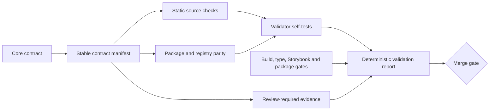

# Nessa Contract Validation Gate Implementation Plan

Status: **Implemented — plan and code independently reviewed PASS 0**
Authority: [`docs/architecture/design-system-contract.md`](../architecture/design-system-contract.md)

## Outcome

Create a root `validation/` system that turns the Nessa Design System Core Contract into executable, reviewable gates. The system must block new architectural regressions now, expose existing transitional gaps without hiding them, and expand as planned contract surfaces are implemented.

The gate is Nessa repository governance built on a small, domain-neutral TypeScript validation kernel. The kernel is intentionally reusable for other TypeScript repositories later, but it is not published as a package in v1 and contains no Nessa paths, token names, or policy. Nessa-specific contracts live in a separate adapter. The system uses readable TypeScript executed with `tsx`, stable contract identifiers, deterministic output, declared inputs, and focused checks that contributors can understand and repair.

Fast feedback is a contract, not an optimization left for later. `pnpm validate` is the read-only source gate used during normal development. It performs no builds, package installs, browser launches, network calls, or subprocess-per-check work. `pnpm validate:full` is the review/CI gate and adds typechecking, tests, clean builds, artifact inspection, registry reproduction, package inspection, and Storybook. The fast path must remain cheap as the repository grows; the full path may be slower because it proves release artifacts.

## Enforcement model

Each contract entry has exactly one state:

- `enforced`: machine-verifiable today; failure blocks local validation and CI.
- `planned`: the contract is normative but its implementation surface does not exist yet; reported explicitly and promoted to `enforced` in the same change that creates the surface.
- `review-required`: semantic judgment cannot be proven reliably by code; the runner prints the required evidence and the pull-request checklist requires reviewer confirmation.

No check may silently skip because a file is missing. Missing inputs are either a failure for an enforced contract or an explicit planned state.

Every `planned` entry defines an activation probe, such as a new provider export or component file. If that surface appears while the contract remains planned, validation fails and requires the implementing change to add the real enforcement check.



## Files to add or change

```text
validation/
├── README.md
├── tsconfig.json
├── contracts.ts
├── exceptions.ts
├── amendments.ts
├── run.ts
├── full.ts
├── build-and-check.ts
├── check-package.ts
├── check-registry.ts
├── verify-github-governance.ts
├── verify-pr-architecture.ts
├── framework/
│   ├── define-check.ts
│   ├── file-index.ts
│   ├── in-memory-cache.ts
│   ├── reporter.ts
│   ├── runner.ts
│   ├── scheduler.ts
│   └── types.ts
├── nessa/
│   ├── source-scan.ts
│   ├── contrast-matrix.ts
│   ├── focus-treatments.ts
│   └── checks/
│       ├── governance.ts
│       ├── contract-coverage.ts
│       ├── css-exports.ts
│       ├── css-ownership.ts
│       ├── registry-parity.ts
│       ├── theme-parity.ts
│       ├── source-boundaries.ts
│       ├── storybook-coverage.ts
│       ├── package-artifacts.ts
│       └── accessibility.ts
└── tests/
    ├── governance.test.ts
    ├── contract-coverage.test.ts
    ├── css-exports.test.ts
    ├── css-ownership.test.ts
    ├── registry-parity.test.ts
    ├── theme-parity.test.ts
    ├── source-boundaries.test.ts
    ├── storybook-coverage.test.ts
    ├── package-artifacts.test.ts
    ├── accessibility.test.ts
    ├── framework.test.ts
    ├── performance.test.ts
    └── fixtures/

.github/
├── CODEOWNERS
├── pull_request_template.md
└── workflows/
    ├── validation.yml
    ├── architecture-review.yml
    └── governance-audit.yml

docs/architecture/design-system-contract.md
.node-version
package.json
pnpm-lock.yaml
README.md
```

Do not add a separately published framework package, pre-commit hook, or mutable generated report. Root development dependencies are limited to `tsx`, `typescript`, `@types/node`, `minimatch`, `postcss`, `postcss-selector-parser`, `culori`, and `@types/culori`: `tsx` executes readable TypeScript, the TypeScript compiler API classifies exports/source syntax, Minimatch resolves declared input globs, PostCSS parses CSS structure, the selector parser distinguishes type and universal selector nodes from class/ID/attribute text, and Culori provides standards-oriented CSS color parsing/conversion primitives. Node 22 built-ins and `node:test` cover everything else. All dependencies are added with pnpm and locked in `pnpm-lock.yaml`; validation imports only direct dependencies, never undeclared transitives.

`validation/tsconfig.json` is independently typechecked and extends the root baseline with `target: "ES2022"`, `module: "NodeNext"`, `moduleResolution: "NodeNext"`, `types: ["node"]`, `strict: true`, `noEmit: true`, and `allowImportingTsExtensions: true`; it includes every `validation/**/*.ts` file. Validation modules use explicit `.ts` imports so runtime and compiler resolution agree.

The implementation updates the core contract's provisional `verification/` wording to the chosen root name `validation/`, changes that governance paragraph from future tense to the active gate, and adds an exhaustive normative contract index. It does not alter any design-system architecture decision.

## Performance, workflow, and reusable kernel

The generic kernel exposes one small typed registration API:

```ts
defineCheck({
  id: "css-ownership",
  phase: "source",
  inputs: ["packages/react/src/**/*.css", "packages/react/package.json"],
  dependsOn: [],
  global: false,
  async run(context) {
    // Return typed findings; never print or mutate process state directly.
  },
})
```

`CheckContext` exposes the repository root, a deterministic file index, memoized `readText`, `readJson`, `parseCss`, `parseSelector`, and `parseTypeScript` helpers, and typed finding builders. A separate orchestration context owns the fixed subprocess service; ordinary checks never receive it. Framework code may depend only on Node/TypeScript/parser APIs and injected adapters; it may not import `validation/nessa`, repository manifests, or product policy. Checks may not use global mutable state, independently walk the repository, print directly, or spawn processes.

Performance rules:

- Build the file index exactly once from `git ls-files --cached --others --exclude-standard`; normalize and sort repository-relative paths once. Fall back to one explicit filesystem walk only in synthetic/temp fixtures that are not Git repositories.
- Resolve each source check's declared input globs with the locked direct `minimatch` dependency after converting repository-relative paths to POSIX `/` separators. Freeze options to `dot: true`, `nocase: false`, `nonegate: true`, `nocomment: true`, and `noext: true`; support only `*`, `**`, `?`, balanced character classes, and braces. Registration prevalidates balanced brackets/braces and rejects leading negation/comment syntax, extglob tokens, and malformed patterns instead of letting them degrade to literals. Artifact checks receive a separately enumerated output manifest from the successful build because ignored `dist` files are intentionally absent from the Git index. A check that needs repository-wide evidence declares `global: true`; undeclared reads fail in validator tests. Fixtures cover Windows separators, dotfiles, root and nested files, braces/classes, case sensitivity, extglob rejection, and invalid/unclosed patterns.
- Treat indexed source content as immutable for one read-only source-gate invocation, and cache file contents plus parsed CSS, selector, JSON, and TypeScript results by normalized path for that invocation. Each file is read and parsed at most once per parser kind per run. Artifact builds create a new runner/cache after the build rather than mutating a live source cache; content-addressed keys are therefore unnecessary in v1.
- Schedule independent checks with bounded concurrency: `min(4, availableParallelism())` by default, configurable downward for constrained machines. Respect `dependsOn`; sort all findings by contract ID/check ID/path before reporting so concurrency never changes output.
- Use no persistent cache in v1, avoiding stale-state bugs and cleanup burden. The internal cache is behind an interface so a content-addressed persistent implementation can be added later without changing check APIs.
- The source runner performs no network work. Its only allowed child processes are a fixed set of Git operations for the shared file index and optional/base governance comparison; ordinary checks cannot spawn processes. Full-phase orchestration uses a small fixed number of repository-level commands, never a subprocess per check or file.

Developer ergonomics are part of the kernel contract. The CLI supports `--list`, `--contract <id>`, `--explain <id>`, `--changed-since <git-ref>`, `--profile`, and `--format text|json`. Default `pnpm validate` runs every source check, which is the safe and expected workflow. Changed mode is an optional local accelerator: it may skip only non-global checks whose declared inputs do not intersect the diff; global checks and dependency closure always run. CI never uses changed mode.

JSON output has an explicit extractable-kernel compatibility contract. Its top level is `{ schemaVersion: 1, selection, summary, results }`; `selection` records requested contracts, changed ref, executed dependency closure, and global checks; `summary` contains deterministic state counts and exit status; each sorted result contains check ID, optional contract ID, state/severity, repository-relative path/line/column, authority, message, and repair text. It contains no timestamps or absolute paths. `--contract` reports selected checks plus dependency closure; `--changed-since` also reports skipped checks and why. Breaking schema changes require a schema-version increment and kernel compatibility review. Schema/snapshot tests prove JSON/text result parity and stable ordering.

The performance self-test injects a deterministic in-memory 10,000-path/file adapter rather than creating 10,000 disk files, and proves structural budgets: one index construction, bounded concurrency, no undeclared reads, no duplicate reads, no duplicate parses, and no subprocesses from ordinary checks. It also has a deliberately generous 5-second wall-clock ceiling on the pinned CI runtime to catch catastrophic algorithmic regressions without turning disk speed or minor machine variance into developer failures. A small temporary-Git fixture separately proves the real indexing adapter. The current repository records an informational cold/warm profile; a 2-second cold source-gate target is documented in `validation/README.md`, but only the stable structural budget and generous CI ceiling are hard gates.

## Stable contract manifest

`validation/contracts.ts` is the typed machine-readable mirror of the contract's normative index. Every entry contains:

```ts
{
  id: "CSS-001",
  title: "Default package CSS excludes Preflight",
  authority: "docs/architecture/design-system-contract.md#low-specificity-and-named-cascade-layers",
  state: "enforced",
  check: "css-ownership",
  activationProbe: null,
  reviewEvidence: null,
}
```

The core contract gains a `Normative contract index` table. That table is the exhaustive list of normative rule units; the detailed sections explain those indexed rules, while the adoption roadmap remains explicitly non-normative. Each row has one stable ID, a concise invariant, and an authority anchor. The initial change indexes every existing permanent-contract, governance, semver, non-goal, and conformance rule group and receives architecture-owner review.

Governance validation compares the Markdown index and TypeScript manifest bidirectionally and fails on a missing, duplicate, or orphaned ID; mismatched titles/anchors; an authority outside the normative portions; or a roadmap anchor. By contract definition, unindexed prose cannot introduce a new normative rule. Adding or changing normative prose therefore requires an index/manifest change in the same review.

Initial contract families:

| Family | Initial enforcement |
| --- | --- |
| `GOV-*` | Core contract exists, README links it, manifest IDs/authority targets are valid and unique. |
| `CSS-*` | Three CSS exports, import/Preflight/body ownership, and package declarations are enforced now. The final `nessa.tokens`/`nessa.components` layer contract is planned until the canonical token source appears. |
| `TOKEN-*` | Current package Light/Dark tokens and registry `nessa-base` values match under enforced `TOKEN-003`; Geist family names remain correct. The generated namespaced canonical chain remains planned until `tokens.ts` appears, and the validator does not freeze ordinary theme values that the core contract leaves changeable. |
| `REG-*` | `registry.json`, `public/r/registry.json`, item JSON, and source component contents remain synchronized; registry dependencies remain complete. |
| `SRC-*` | No host document mutation from library-owned runtime code; no private `--_nessa-*` references in copied registry source; forbidden patterns cannot expand beyond declared exceptions. |
| `STORY-*` | Every exported component has a colocated Storybook documentation story tagged for docs/tests; Input examples retain accessible labels. |
| `PKG-*` | React 19 peer floor, CSS side effects, prepack build, license inclusion, and public CSS exports remain declared. |
| `A11Y-*` | Storybook accessibility and canonical token contrast are enforced now. Existing target-size/zoom/reflow rules are `review-required` until their browser checks land; missing fixtures never qualify as `planned`. |
| `PROVIDER-*` | Planned until the provider implementation lands; the provider change must promote its relevant entries to enforced. |
| `ICON-*` | Planned until a real semantic-icon consumer lands. |

The runner validates that every `enforced` entry resolves to a registered check, every `planned` entry resolves to a registered activation probe, and every `review-required` entry has explicit evidence instructions. Contract IDs may be retired with history but are never recycled.

State transitions are governed:

- `planned → enforced` is required when its activation probe detects the surface;
- an enforced contract with exceptions remains enforced and returns to zero exceptions when migration completes;
- `enforced → planned`, weakening/removing a check, weakening an activation probe, or adding an exception requires an explicit normative contract amendment with compatibility, migration, and architecture-owner authorization under the author-role rule below;
- IDs may be retired but never repurposed.

`validation/amendments.ts` is an append-only typed history for every governed-manifest transition, including strengthening, weakening, or retirement. Each entry records a stable amendment ID, the exact governed source targets changed, transition kind, canonical before/after fingerprints, rationale, compatibility impact, migration/removal condition, and pull-request reference. The canonical snapshot hashes LF-normalized complete source for `validation/contracts.ts` (including probes), `validation/exceptions.ts`, and `validation/nessa/check-metadata.ts`, then hashes the path-keyed digest map. This is deliberately stricter than field-level weakening detection: formatting or structural changes to those authority files also require a reviewed transition, while ordinary checker implementation remains semantic-review-owned rather than function-source fingerprinted.

CI checks out full Git history and passes the pull-request base SHA (or the previous push SHA on `main`) to the governance checker. The checker reads the base revision's governed sources and amendment ledger with `git show`; any snapshot change requires one appended transition whose targets exactly equal the changed governed paths and whose before/after fingerprints exactly equal the computed base/current snapshots. Contract removal additionally requires one zero-target retirement marker per removed ID, all bound to that same snapshot transition, so one change may retire multiple contracts without creating ambiguous competing transitions. This contains all narrower weakening classes—state downgrade, check/probe deletion or narrowing, `global: true → false`, exception addition/broadening, and retirement—without relying on an incomplete semantic parser. Existing amendment entries may never be changed, reordered, or deleted under any circumstance. Corrections and supersessions are new appended entries; a new entry can authorize only its exact content-addressed transition and can never authorize rewriting amendment history. Local `pnpm validate` proves current-tree consistency without fetching; if `origin/main` is locally available it also compares the merge base, while the CI environment supplies the exact base SHA.

The one-time bootstrap is explicit. The initial ledger contains immutable `BOOTSTRAP-001`, recording the exact pre-validation base revision and the canonical fingerprint of the first manifest; the Git commit containing that entry is itself the first governed commit, so the source file does not need to predict its future SHA. A pull-request URL is recorded when one exists but is optional for a direct authorized commit. If the base revision has no validation manifest, history comparison accepts that absence only when the current ledger begins with `BOOTSTRAP-001`, emits `REVIEW GOV-BOOTSTRAP`, and still enforces complete current-tree index/manifest/check/probe/exception consistency. Authorization follows the satisfiable owner-role rule defined below: authenticated owner authorship plus one current non-author approval, or current owner approval when someone else authors. Once any base contains the manifest, its later absence or any second bootstrap is always a failure. An absent/all-zero previous-push SHA on the first post-merge push uses the merge commit's first parent; if that object is unavailable, governance fails with a fetch/history repair message rather than skipping. Synthetic tests cover owner-authored and non-owner-authored initial PRs, first push after merge, normal later PR, shallow/missing base, all-zero SHA, and attempted second bootstrap.

No mechanical fingerprint can prove that an implementation body was not semantically weakened. Therefore every change under governed paths—including check implementation—is code-owner/review-required even when fingerprints do not change. Automated history comparison detects structural weakening; independent architecture review owns semantic weakening. The runner and documentation state that boundary explicitly rather than claiming local code can prove reviewer judgment.

## Temporary exception ledger

`validation/exceptions.ts` records only existing transitional divergences. An exception is not a manifest state: the owning contract remains `enforced` and its normal checker always runs. Initial exceptions are expected for the current Nessa-owned `dark:*` component classes and package `@custom-variant dark` declaration, because the core contract explicitly requires their later semantic-token replacement. Two exact `A11Y-*` entries also cover the current Light-mode `--input` against `--background` and `--border` against `--background` control/surface boundaries, which are below 3:1. Dark-mode pairs remain in the matrix and must pass; they are not omitted or blanket-excepted. These contrast exceptions are removed when the canonical theme migration supplies compliant boundary tokens.

Occurrence exceptions must specify:

- contract ID;
- exact repository-relative file;
- exact string or narrowly anchored regular expression;
- maximum occurrence count;
- rationale;
- removal condition.

Contrast exceptions are a separate typed variant and specify contract ID, exact mode, exact foreground/boundary token, exact adjacent-background token, required ratio, maximum accepted current shortfall fingerprint, rationale, and removal condition. They cannot match another mode or pair. Changing the underlying token values makes the exception stale and fails, forcing the migration or an explicitly reviewed amendment rather than silently blessing a different failure.

The checker suppresses only exact ledger matches and fails on unmatched violations, unused/stale exceptions, count increases, count decreases that should remove an entry, missing removal conditions, wrong-contract references, or moved/broadened patterns. An empty ledger is the enforced steady state. Adding an exception requires an explicit core-contract amendment/review; it is never an ordinary way to make CI green.

## Checks

### Governance

- Validate manifest schema, unique IDs, legal states, registered checks, authority file existence, and Markdown anchor existence.
- Confirm README links the core contract.
- Confirm the core contract still states that implementation plans cannot silently override it.

### CSS exports and ownership

- Parse CSS with `postcss` and parse every qualified rule's selector with `postcss-selector-parser`. Checks inspect selector node kinds: only a `tag` node named `body` is a body selector and only a `universal` node is a universal selector. Classes such as `.body`, IDs, attribute values such as `[data-part="body"]`, escaped/custom identifiers, comments, strings, data URLs, declarations, and `calc(... * ...)` cannot trigger those rules. CSS or selector parse errors and unknown import shapes fail with source line/column diagnostics.
- Inspect `@import` parameters across quoted and `url(...)` forms using the parsed at-rule rather than raw-file substrings.
- Assert `theme.css` contains no `@import`, `body`, Preflight, or universal reset.
- Assert `styles.css` imports only Tailwind theme/utilities plus Nessa theme, never `tailwindcss` aggregate or Preflight, and owns no `body` rule.
- Assert `app.css` imports `styles.css` and Tailwind Preflight and contains the application baseline.
- Assert package `exports`, build outputs, `sideEffects`, and README descriptions cover all three CSS files.
- Source-phase checks never read `dist`. `validation/build-and-check.ts` runs the package build—which begins by cleaning `dist`—and then invokes artifact-phase checks in the same process, proving the inspected output was produced by that successful invocation.
- Artifact checks prove `dist/styles.css` lacks representative Preflight selectors while `dist/app.css` contains them and fail if any expected output is missing.

### Theme and registry parity

- Parse the current `:root`/`.dark` public theme variables from `packages/react/src/theme.css`.
- Compare the exact shadcn mapping against `registry.json` and generated `public/r/nessa-base.json`, including `card`, `ring`, font stacks, and radius.
- Compare every generated registry item's embedded source with its canonical source file.
- `check-registry.ts` runs `shadcn build registry.json --output <temporary-directory>`, compares every temporary catalog/item with committed `public/r`, compares embedded strings byte-for-byte after canonical LF normalization, and removes its temporary directory in `finally`. It never writes `registry.json` or `public/r`.
- Freeze any normalization as an enumerated JSON-pointer allowlist. Unknown paths are compared; the initial preference is no ignored paths beyond line-ending normalization for embedded source.
- Validate dependency lists against imports and required registry dependencies rather than assuming two agreeing generated files are reproducible.
- Fail with the contract ID, item, variable/file, expected value, and actual value.

### Source boundaries

- Scan library-owned runtime code (`packages/react/src` and registry-targeted component source) only for the host-document/persistence boundary. The Storybook application harness is deliberately outside that ownership rule: as an app, it may coordinate its own document during the provider transition. Storybook output, `dist`, `.git`, dependencies, generated registry JSON, documentation examples, tests, and fixtures are excluded from this specific scan and covered by their owning checks.
- Reject `document.documentElement`, `document.body`, direct theme persistence, new Nessa-owned `dark:*`, and direct private alias usage in those library-owned surfaces unless exactly covered by the exception ledger.
- Use token-aware or tightly anchored scans and validator self-tests to control false positives.

### Storybook coverage

- Use the TypeScript compiler API. A public component is a PascalCase runtime export whose declaration originates in `packages/react/src/components/*`; type-only exports, CVA variants, constants, and utilities are excluded.
- One module-level story may cover compound exports such as `Card`, `CardHeader`, and `CardContent`; the story maps to the originating component module rather than requiring redundant files.
- Require a matching story with `autodocs` and `test` tags.
- Require the existing Input default and invalid stories to render an explicit associated label or accessible name.
- Leave visual prose quality as `review-required`; do not pretend a string-length check proves documentation quality.

### Accessibility and canonical contrast

`validation/nessa/contrast-matrix.ts` is the executable pair contract. Every pair is evaluated in both Light and Dark unless a mode is explicitly named. The initial matrix contains:

| Foreground/boundary | Adjacent background | Minimum | Role |
| --- | --- | ---: | --- |
| `--foreground` | `--background` | 4.5 | normal text |
| `--card-foreground` | `--card` | 4.5 | normal text |
| `--popover-foreground` | `--popover` | 4.5 | normal text |
| `--primary-foreground` | `--primary` | 4.5 | normal text |
| `--secondary-foreground` | `--secondary` | 4.5 | normal text |
| `--muted-foreground` | `--muted` | 4.5 | normal text |
| `--accent-foreground` | `--accent` | 4.5 | normal text |
| `--destructive-foreground` | `--destructive` | 4.5 | normal text |
| `--input` | `--background` | 3.0 | required control boundary |
| `--border` | `--background` | 3.0 | required surface/control boundary |
| `--ring` | `--background`, `--card`, `--popover` | 3.0 | focus source color, before treatment opacity |

The matrix does not infer large text; all text pairs use the safer 4.5 normal-text threshold. Values must be a single `oklch()` color (with optional percentage/number alpha) or an explicitly resolved public token reference. Unsupported syntax, missing variables, cyclic references, malformed colors, and non-finite results fail instead of being guessed. Culori parses and converts in-sRGB OKLCH values; alpha foregrounds composite over their declared adjacent background in linear-light sRGB before WCAG 2.x relative luminance and `(Llighter + 0.05) / (Ldarker + 0.05)` are calculated. An alpha background must itself declare the next opaque backdrop in the matrix; unresolved transparency fails.

A valid CSS/OKLCH value outside sRGB is not a failure and does not introduce an unapproved sRGB-only theme restriction. It emits `REVIEW A11Y-WIDE-GAMUT` with the exact pair/mode and requires color-managed browser evidence until the planned browser contrast fixture can evaluate the rendered color on the supported display profile. Malformed or unsupported syntax still fails. The manifest contains this explicit `review-required` contract, and a valid Display-P3-capable/out-of-sRGB OKLCH fixture proves it routes to review rather than clamp/fail.

Comparison uses full-precision values with a `1e-6` numerical tolerance only for floating-point noise; a result below `minimum - 1e-6` fails. Tests cover published WCAG black/white and gray reference cases plus exact pass, exact fail, threshold edge, OKLCH percentage syntax, alpha compositing, token references, malformed input, unsupported syntax, cyclic references, and out-of-gamut input. Light `--input`/`--background` and `--border`/`--background` remain exact temporary exceptions; every other base-token matrix entry must pass today.

The `--ring` row proves only that the source color is capable of contrast; it is not presented as proof of the rendered focus indicator. `validation/nessa/focus-treatments.ts` separately inventories every current focus/invalid treatment by exact component module, state, token, opacity/color-mix percentage, mode, and canonical adjacent surfaces (`--background`, `--card`, and `--popover`). The source checker parses component class strings and fails if a `focus-visible:ring-*`, `focus-visible:border-*`, `aria-invalid:ring-*`, or `aria-invalid:border-*` treatment is missing from the inventory, changes opacity/token, or is newly introduced without a matrix entry.

Effective treatment colors are evaluated after their class opacity/color-mix semantics and compositing against each canonical adjacent surface. Full `border-ring`/`border-destructive` treatments and rendered rings are reported separately; one passing layer does not silently mark another failing layer compliant. The reviewed bootstrap ledger contains exactly 18 initial focus exceptions—never checker-generated:

- Light Button non-destructive focus `ring-ring/40` × background/card/popover (3);
- Light Badge focus `ring-ring/40` × background/card/popover (3);
- Light Input valid focus `ring-ring/40` × background/card/popover (3);
- Light Button destructive focus `ring-destructive/30` × background/card/popover (3);
- Dark Button destructive focus `ring-destructive/30` × background/card/popover (3);
- Light Input invalid focus `ring-destructive/20` × background/card/popover (3).

Each ledger tuple names the component module, state, mode, token, opacity/treatment, adjacent surface, required ratio, canonical source-value fingerprint, rationale, and semantic focus/invalid-token removal condition. Dark `ring-ring/40` and Dark invalid `ring-destructive/40` remain enforced because they pass. Any failing tuple outside those 18 exact entries fails; a stale or newly passing entry also fails and must be removed. Button default/destructive, Badge, and Input default/invalid fixtures prove treatment discovery, opacity override precedence, Light/Dark evaluation, exact surface matching, rejection of a newly failing surface, and exception staleness. Browser/computed-style focus geometry remains `review-required` until the browser fixture lands; token and effective-color contrast are enforced now.

## Runner and output

`pnpm exec tsx validation/run.ts --phase=source|artifacts`:

1. locates the repository from `import.meta.url`, not the caller's current directory;
2. loads and validates the manifest;
3. schedules dependency-safe checks with bounded concurrency and sorts their results in contract-ID order;
4. catches check crashes and reports them as failures;
5. prints deterministic `PASS`, `FAIL`, `EXCEPTION`, `PLANNED`, and `REVIEW` rows;
6. exits nonzero for failures; `REVIEW` rows are enforced externally through required independent approval, not self-attested by the author;
7. prints a final count and repair-oriented messages with authority links.

No timestamps, colors in non-TTY output, absolute machine paths, or network calls are allowed. The source runner never writes the working tree. Validator self-tests and registry reproduction may use `node:os` temporary directories with guaranteed cleanup. Full artifact validation is source-preserving rather than literally write-free: it may replace only declared ignored build outputs such as `packages/react/dist` and `apps/storybook/storybook-static`.

## Package scripts and CI

Add contributor scripts:

```json
{
  "validate:contracts:source": "tsx validation/run.ts --phase=source",
  "validate:contracts:test": "tsx --test validation/tests/*.test.ts",
  "validate:artifacts": "tsx validation/build-and-check.ts",
  "check:registry": "tsx validation/check-registry.ts",
  "check:package": "tsx validation/check-package.ts",
  "verify:github-governance": "tsx validation/verify-github-governance.ts",
  "verify:pr-architecture": "tsx validation/verify-pr-architecture.ts",
  "typecheck:validation": "tsc -p validation/tsconfig.json --noEmit",
  "typecheck": "pnpm -r typecheck && pnpm typecheck:validation",
  "validate": "pnpm validate:contracts:source",
  "validate:full": "tsx validation/full.ts"
}
```

`validation/full.ts` is the sole full-gate orchestrator. Before any command, it snapshots the sorted path set and SHA-256 content of `git ls-files --cached --others --exclude-standard`, thereby protecting both tracked files and pre-existing nonignored untracked contributor work. It then invokes the source runner, validator self-tests, repository typecheck/tests, clean build plus artifact checks, temporary registry reproduction, package manifest inspection, and Storybook build in the declared order. A single outer `try/finally` always rebuilds the same index and compares paths/content, even when an intermediate command fails; created, removed, or modified paths are reported. It also compares the top-level ignored-path inventory from `git ls-files --others --ignored --exclude-standard --directory` and rejects newly created ignored roots outside the enumerated build outputs (`packages/react/dist`, `apps/storybook/storybook-static`, and OS temporary directories). Arbitrary mutations inside pre-existing ignored content such as `node_modules` are honestly outside preservation enforcement. Known build outputs are validated separately; no claim is made about unrelated ignored-directory contents.

`build-and-check.ts` runs `pnpm build` with inherited stdio, requires the clean-first package build to succeed, and immediately runs artifact-phase checks against those outputs. It does not accept pre-existing `dist` as evidence. Full-gate preservation belongs to `full.ts`, so it covers every command rather than only the package build.

`check-package.ts` runs `npm pack --dry-run --json --ignore-scripts` with `cwd` set to `packages/react` after the fresh build. It validates JS, declarations, all three CSS files, README, LICENSE, and the deliberately published JS source map, and rejects unintended workspace/source files. The normal declaration check separately enforces that `prepack` exists.

`validation.yml` runs exactly on `pull_request` types `opened`, `synchronize`, `reopened`, and `ready_for_review`, plus pushes to `main`. It does not rerun the expensive build/browser/package gate on `pull_request_review`, because approval changes do not change source artifacts; the small architecture-review status described below owns review events. It uses:

- `.node-version` pinned to `22.13.0`;
- pnpm exactly `11.9.0` from `packageManager`;
- `actions/checkout@3d3c42e5aac5ba805825da76410c181273ba90b1` (`v7.0.1`) with `fetch-depth: 0` so governance can compare the exact base revision;
- `pnpm/action-setup@0977fd99725f1db4007ccb2928dbb4e90d06cc86` (`v6.0.10`) before Node cache configuration;
- `actions/setup-node@820762786026740c76f36085b0efc47a31fe5020` (`v7.0.0`) with pnpm cache keyed by `pnpm-lock.yaml`;
- explicit `node --version` and `pnpm --version` assertions;
- `pnpm install --frozen-lockfile`;
- `pnpm --filter @nessa-ui/storybook exec playwright install --with-deps chromium` before tests;
- `pnpm validate:full`, with `NESSA_VALIDATION_BASE_REF` set to the pull-request base SHA or previous push SHA so nested pnpm scripts receive the exact comparison revision.

Actions are pinned to full commit SHAs with release tags in comments. The artifact-validation workflow uses ordinary `pull_request`/`push`, never `pull_request_target`; permissions are `contents: read` and `pull-requests: read`, superseded commits are cancelled through deterministic concurrency groups, and no publication credentials are available. Browser installation is CI provisioning and may use the network; the validation runner itself remains offline.

The clean-CI acceptance test uses an empty Playwright cache and no existing `dist`, `public/r` temporary output, or Storybook build.

### Independent review enforcement

`.github/CODEOWNERS` requests architecture review from `@Varuas37` for every contract-governed path: `packages/react/**`, `apps/storybook/**`, `registry.json`, `public/r/**`, `validation/**`, design-system documentation, root package/toolchain configuration, and `.github/**`. Future governed top-level surfaces must be added in the same change that creates them. Because the repository currently has only one confirmed architecture owner, required code-owner approval is **not** enabled: it would deadlock a pull request authored by that owner. The required ruleset instead requires:

- the validation workflow status;
- at least one approving review from someone other than the author;
- dismissal of stale approvals after new commits.

Architecture authorization uses one satisfiable role rule for ordinary conformance, bootstrap, and amendments:

- When GitHub reports `@Varuas37` as the pull-request author, that authenticated authorship is the owner's authorization; one current-head approval from a different reviewer supplies independent conformance review. It does not require a second PR approval or impossible self-approval.
- When anyone else authors the change, `@Varuas37` must approve; that owner approval is also the required non-author conformance approval.

`review-required` contracts are satisfied through the applicable current-head approval. The PR template records the semantic evidence for the reviewer to evaluate, but the trusted status does not pretend to parse or authenticate free-form prose. Amendments and `BOOTSTRAP-001` carry their machine-validated evidence in source. `validation/verify-pr-architecture.ts` queries the authenticated PR author, exact head SHA, current non-dismissed approvals and their commit IDs through fixed GitHub API calls; it accepts only an approval bound to the current head and applies the role rule above. `.github/workflows/architecture-review.yml` executes only the default branch's trusted workflow definition: `workflow_run` publishes immediately after artifact validation for new/synchronized heads, while a five-minute `schedule` reevaluates every open pull request after review submissions, edits, or dismissals; `workflow_dispatch` provides an explicit retry. It never uses the PR-controlled `pull_request_review` workflow definition, never checks out the pull-request head, and treats PR values only as API data. The bounded polling delay is the tradeoff for fork-safe write authority without introducing a GitHub App.

Because a `workflow_run`/review workflow's own check is not guaranteed to attach to the PR head SHA, the trusted script creates or updates a dedicated `architecture-conformance` check run on the exact API-reported PR head SHA. Its token is scoped to `contents: read`, `pull-requests: read`, and `checks: write`; there are no other secrets or write scopes, no PR code execution, and the check-run write is the sole external mutation. `pnpm verify:pr-architecture` is read-only by default; only the trusted workflow passes `--publish-check`. Missing/ambiguous PR-to-head mapping fails closed. The required ruleset requires this dedicated status as well as artifact validation. Fixtures cover head-SHA targeting/update idempotence, owner-authored bootstrap/amendment/ordinary PRs, non-owner-authored equivalents, stale/dismissed approvals, and no double-approval requirement. During the one-time bootstrap—before this trusted default-branch workflow exists—the independent plan/code review and `BOOTSTRAP-001` are manual evidence; merge protection is not claimed active until the workflow and ruleset audit pass after merge.

Required code-owner approval may be enabled later only after a team such as `@nessalabs/design-system-architecture` exists with at least two eligible members who have repository review access; readiness verification must confirm team membership/access before recommending that change. No team or membership is invented by this implementation.

`validation/verify-github-governance.ts` is an explicit online audit, separate from the offline kernel. Through a fixed `gh api GET /repos/nessalabs/nessa_ui/rules/branches/main` request, it verifies the active `main`-branch rule set: required validation and `architecture-conformance` status names, one required approving review, stale-approval dismissal, and current code-owner-review setting consistent with readiness. It prints either `merge protection confirmed active`, `validation passes but merge protection is not confirmed`, or an actionable mismatch and exits nonzero for missing/mismatched/unavailable evidence. Saved representative API fixtures self-test rule parsing without network access.

The audit runs once read-only during rollout, on pushes to `main`, on a weekly `schedule`, and through `workflow_dispatch` in `.github/workflows/governance-audit.yml`; it is not part of `pnpm validate`/`validate:full`. The audit workflow has read-only permissions. Fork pull requests run the offline validation workflow but not the online audit; unavailable API/auth never gets mislabeled as confirmed protection. If the required repository rule is absent, enabling it is reported as an external configuration step and the gate is not described as merge-blocking until the user separately authorizes that repository mutation.

The pull-request template requires:

- applicable contract IDs;
- automated validation result;
- review-required evidence;
- explicit contract amendment/migration notes when behavior changes.

## Validator self-tests

Each high-risk checker has a focused test module. The bootstrap suite freezes the failure modes that would otherwise create false confidence:

- governance snapshot changes without an amendment, immutable-history rewrites, duplicate/no-op transitions, invalid supersession references, and a second bootstrap;
- changed-mode dependency closure, untracked-path inclusion, bounded scheduling, deterministic reporting, authority preservation, undeclared-read crash isolation, normalized per-invocation memoization, and the framework/Nessa import boundary;
- exact CSS import allowlists, selector false positives, unscoped reset selectors (including `*:not(...)`), Tailwind custom-property initialization, and scoped descendant variants;
- token resolution/cycles, alpha and wide-gamut contrast behavior, semantic ring/border focus discovery, comments/prose exclusion, and the exact 18-tuple focus exception set;
- class-token comments/prose exclusion, multiline/template class surfaces, document-root aliases/element access/destructuring, qualified persistence globals, and private aliases in style/object/property APIs;
- registry embedded-source normalization, complete source-owned metadata projection, import-derived dependencies, and multi-file dependency unioning;
- exact package root/CSS exports and prepack contract, Storybook meta/tag/named-story/component binding, compound export discovery, and per-story Input label/error associations;
- paginated approval precedence beyond 100 reviews/open PRs, owner/non-owner approval roles, head-bound check creation/update, active-rules parsing, trusted workflow triggers, and CODEOWNERS coverage;
- temporary-Git full-orchestrator preservation on success and command failure, including tracked/untracked mutations, allowed build replacement, and unexpected ignored roots;
- 10,000-path indexing/matching remains within the deliberately generous structural budget.

These fixtures test reusable parsers and policy decisions without mutating repository sources. A new checker behavior or a repaired bug must add the smallest positive/negative regression fixture that proves that behavior; the plan does not claim an artificial Cartesian fixture matrix where a shared runner already owns missing-input/crash behavior.

Self-tests use temporary directories from `node:fs`/`node:os`, clean them in `finally`, and never edit the working tree.

## Review and rollout sequence

1. Review this plan against the core contract and repository contributor model until independent reviewers return `PASS 0`.
2. Implement the manifest, runner, libraries, static checks, exception ledger, and self-tests.
3. Run `pnpm validate:contracts:source` and its self-tests before wiring the remaining root scripts.
4. Add root scripts, PR template, and CI workflow.
5. Run the complete gate and inspect deterministic failure output by deliberately exercising validator fixtures, not by corrupting repository files.
6. Run an independent code-review loop; fix every issue and re-review until `PASS 0`.

## Acceptance

- The TypeScript validation system is deterministic and exposed through root pnpm scripts. Its direct runner locates the repository independently of the caller's working directory. The source gate is read-only; the full gate may replace only enumerated ignored build outputs and proves in `finally` that tracked and nonignored untracked repository content did not change.
- The core contract index and manifest cover each other exactly; every contract has a valid normative authority and explicit enforcement state.
- Existing transitional violations are narrow exceptions; new occurrences fail.
- Existing component accessibility requirements are enforced or review-required, never planned merely because a fixture is missing.
- Static CSS, package, registry, source-boundary, governance, and Storybook checks pass on the current repository.
- Validator self-tests prove meaningful negative cases.
- `pnpm validate` is the fast source-only inner-loop gate. `pnpm validate:full` gates reviews/CI in source → validator tests → typecheck/tests → clean build/artifact checks → registry reproduction → package manifest → Storybook order.
- The reusable kernel contains no Nessa policy, indexes files once, memoizes reads/parses, runs with bounded concurrency, and passes its 10,000-file structural/performance fixture. Ordinary checks spawn no child processes.
- Artifact validation runs on every pull request and push to `main` without write permissions. The trusted architecture workflow has only `checks: write` in addition to read scopes, solely to publish/update the exact head-bound conformance check.
- Every contract-governed implementation and governance path has CODEOWNERS, and the required external review/ruleset status is verified rather than implied.
- Failure messages name the contract, evidence, authority, and repair path.
- The implementation and its plan both receive independent `PASS 0` reviews.

## Commands before completion

```bash
pnpm validate:contracts:source
pnpm validate:contracts:test
pnpm validate
pnpm validate:full
git diff --check
```

Do not run pre-commit hooks or `./verify.sh`; neither is part of this contract gate.
