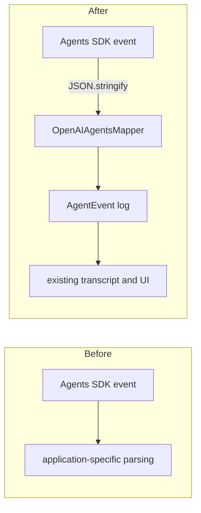

# OpenAI Agents SDK support in `agent-stream`

Status: implemented against `@openai/agents` 0.17.0 and `openai` 7.9.0 on
2026-09-04.

## Observed data

The low-level OpenAI JavaScript SDK reads HTTP SSE frames such as:

```text
event: response.output_text.delta
data: {"type":"response.output_text.delta","sequence_number":3,"item_id":"msg_1","output_index":0,"content_index":0,"delta":"Hi"}
```

and yields the parsed `data` object unchanged. The higher-level Agents SDK
normalizes provider events again. An exercised `ScriptedModel` function-tool
run produced this shape (the complete capture is checked in):

```json
{"data":{"type":"response_started"},"type":"raw_model_stream_event"}
{"name":"tool_called","item":{"type":"tool_call_item","rawItem":{"type":"function_call","callId":"call_1","name":"lookup","arguments":"{\"q\":\"weather\"}"},"agent":{"name":"Researcher"}},"type":"run_item_stream_event"}
{"name":"tool_output","item":{"type":"tool_call_output_item","rawItem":{"type":"function_call_result","callId":"call_1"},"agent":{"name":"Researcher"},"output":"sunny","executionStatus":"executed"},"type":"run_item_stream_event"}
```

| SDK event | Nested discriminator | Meaning |
| --- | --- | --- |
| `raw_model_stream_event` | `data.type` | token delta, model-request start/done, or provider event |
| `run_item_stream_event` | `name` | committed message, tool/output, handoff, reasoning, approval, compaction |
| `agent_updated_stream_event` | `agent.name` | active agent changed |

The raw stream supplies previews and request usage. Run items are authoritative
for executed tools and committed content. A low-level function-arguments-done
event only proves the model finished asking for a tool; `tool_output` proves
the Agents SDK actually ran it.

## Implemented mapping

| Agents SDK shape | `AgentEvent` | Notes |
| --- | --- | --- |
| first event | `session_started` | host provides run id/model because events omit them |
| `data.output_text_delta` | `delta/text` | preview keyed by `itemId` |
| `message_output_created` | `assistant_text` | committed text supersedes preview |
| `tool_called` / `tool_output` | tool start/completion | function, hosted, shell, computer, patch, and MCP tools |
| configured `agentToolNames` | tool + task lifecycle | SDK serializes `agent.asTool()` as an ordinary function tool, so the host supplies the names |
| tool-search call/output | tool start/completion | deferred tool discovery |
| handoff requested/occurred | tool lifecycle | replaces the active agent; this is not nested agent work |
| agent updated | `status_changed` | records the newly active agent |
| tool approval requested | `permission_requested` | the run pauses through `RunState` |
| reasoning item | `reasoning` | emitted when readable text exists |
| compaction item | `context_compacted` | boundary visible; token delta unavailable |
| every `response_done` | accumulated usage | one run can make several model requests |
| mapper `finish()` | `turn_completed` | call after `stream.completed`; can be interrupted/error |

## Limits the host must own

- The iterator does not emit the original user message.
- Approval decisions are `RunState` mutations, not iterator events; record the
  decision separately if transcript replay must display it.
- An `agent.asTool()` parent stream serializes it as an ordinary function tool.
  Pass its name through `agentToolNames` to get task lifecycle events. Nested
  events only reach its `onStream`/event hooks and require a separately scoped
  mapper when a nested transcript is required.
- The exercised `ScriptedModel` agent-as-tool capture omits message/item IDs on
  its final text events, so it also verifies the mapper's synthetic message-ID
  fallback rather than pretending every SDK model supplies correlation IDs.
- Automatic compaction may finish after the last text token. Await
  `stream.completed` before `finish()`. The item is encrypted and exposes no
  pre/post token totals.
- Guardrail failures and runner exceptions may be thrown rather than streamed.
  Catch them and call `finish({ status: "error", error: message })`.

## Consumer path


