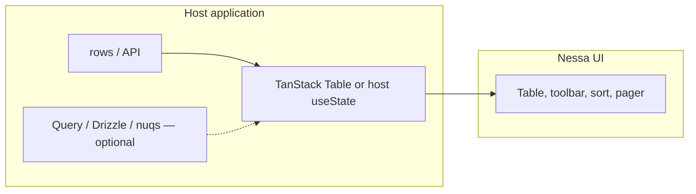
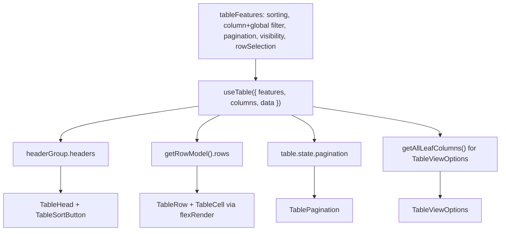

# Data table landscape

Research against primary sources, 2026-09-07.

Sources:

- Nessa Table kit: `packages/react/src/components/table/` and `apps/storybook/stories/table.stories.tsx`
- [openstatusHQ/data-table-filters](https://github.com/openstatusHQ/data-table-filters) README and [docs](https://data-table.openstatus.dev/llms-full.txt)
- [TanStack Table latest](https://tanstack.com/table/latest), plus the v9 [virtualization](https://tanstack.com/table/v9/docs/framework/react/guide/virtualization) and [migration](https://tanstack.com/table/v9/docs/framework/react/guide/migrating) guides

This is a comparison of **layers**, not of visual fidelity. The three projects do not compete for the same job.

## 1. What each project is

| Project | Job | Ships | Owns |
| --- | --- | --- | --- |
| **Nessa Table** | Design-system presentation kit | Semantic `<table>` chrome, toolbar, sort button, pagination | Markup, tokens, a11y, host-wired state |
| **TanStack Table** | Headless table engine | Nothing visual. `useTable` + tree-shakable features | Row models, column defs, typed state APIs |
| **OpenStatus data-table-filters** | Application playbook | shadcn registry blocks copied into an app | Schema → generators → TanStack Table + Query + optional Drizzle/nuqs/Zustand |

Nessa's own Storybook description already names the intended split: filtering, sorting, column visibility, and pagination are separate pieces so a host wires **its own table state or a headless table library**. TanStack Table is that library. OpenStatus is a full product recipe *on top of* TanStack Table and shadcn/ui.



OpenStatus collapses the host box into one copied playbook. Nessa should not.

The design-system contract already assigns this split: Nessa owns presentation; the application owns lifecycle, fetching, persistence, and product state (`docs/architecture/design-system-contract.md`). Putting TanStack Table, nuqs, or Drizzle inside `@nessalabs/ui` would cross that line.

## 2. Nessa Table — what we already ship

Composable primitives, not a data-grid:

- **Shell and grid:** `TableShell`, `Table` (scroll frame), `TableHeader` (optional `sticky`), `TableBody`, `TableFooter`, `TableRow`, `TableHead`, `TableCell`, `TableCaption`, `TableEmpty`
- **Toolbar:** `TableToolbar`, `TableSearchField`, `TableFilterToggle`, `TableFilterPanel`, `TableFilterSelect` (single-select facet with optional counts), `TableViewOptions` (column visibility, locked columns, restore-in-order)
- **Sort:** `TableSortButton` plus host-owned `aria-sort` on `TableHead`
- **Pager:** `TablePagination` with a windowed page range, clamped `page`, and a status-region summary

The stories already compose search, faceted filters, selection checkboxes, sortable headers, column toggling, overflowing columns, and a capped-height sticky header. All of that state lives in the story — there is no table engine in the kit.

Presentation work that is stronger than both comparison projects:

- Overflow is **measured**, not assumed. The scroll container only becomes a named, keyboard-focusable `region` while it actually overflows (`containerLabel`).
- Sticky headers keep **semantic table markup**. The kit pins `th` cells and draws a sibling focus ring so opaque sticky cells cannot swallow `:focus-visible`.
- Result summaries are **status regions**, and the Agent Traces story debounces the search that feeds them so live typing is not announced per keystroke.
- `TableEmpty` is deliberately **not** a live region, so it does not double-announce with the pager summary.
- Restoring a hidden column slots it back among its neighbours, including ids the column menu does not describe (selection / actions columns).

Select-all against currently visible rows is **host logic** in the SelectionAndColumns story, not a Table primitive. `TableRow` only styles `data-state="selected"`; the header checkbox and its measurement live in the host.

Deliberate non-goals, documented in `packages/react/README.md`: Table is **not** virtualized. `VirtualList` is a fixed-row list renderer; pagination and pane lifecycle stay the table contract.

## 3. OpenStatus data-table-filters — what they actually ship

Not an npm library. A **playbook**: copy shadcn registry blocks into the app. Stack on their docs: React 19, **TanStack Table v8 moving to v9**, TanStack Query, Tailwind v4, shadcn/ui. Next.js App Router is first-class.

Three layers:

1. **Table schema** — `createTableSchema` + `col.*` factories. One definition generates TanStack `ColumnDef[]`, filter fields, sheet fields, and a filter-state schema.
2. **BYOS store** — adapter for filter state: nuqs (URL), Zustand, or memory.
3. **UI** — `DataTableInfinite`, accordion filter sidebar, command palette, row-detail sheet, floating bulk-action bar, cell renderers.

Column factories and allowed filters:

| Factory | Default display | Allowed filters |
| --- | --- | --- |
| `col.string()` | text | input |
| `col.number()` | number | input, slider, checkbox |
| `col.boolean()` | boolean | checkbox |
| `col.timestamp()` | relative time | timerange |
| `col.enum(values)` | badge | checkbox (multi-select) |
| `col.array(...)` | badge | checkbox |
| `col.record()` | text | none (sheet-only) |
| `col.select()` | checkbox column | none |

Presets are observability-shaped: `logLevel`, `httpStatus`, `httpMethod`, `duration`, `timestamp`, `traceId`, `pathname`.

Filter UI they build that Nessa does not:

- Multi-select checkbox facets with search and counts
- Dual-thumb numeric sliders whose **own bounds do not collapse** while dragging (three-pass server filtering: date → non-slider facets → all filters)
- Date-range picker with presets
- Command palette (`Cmd+K`) with `host:API`, `latency:100-500` syntax, history, and an optional AI natural-language path
- Infinite scroll + cursor pagination via `useInfiniteQuery`
- Row-detail sheet generated from `.sheet()` columns
- Floating bulk-action bar
- Optional timeline chart over the table, live mode, Drizzle `WHERE`/facet/cursor helpers, MCP endpoint over the same schema

Cell catalog: text (overflow tooltip), code, number+unit, bar, heatmap, gauge, badge, boolean, star, HTTP status coloring, severity dot, relative timestamp.

This is a **logs/traces product table**. The schema, SQL helpers, URL state, and AI filter parser are application concerns. Copying the playbook into `@nessalabs/ui` would ship Next, Drizzle, nuqs, and a command-syntax parser as if they were design-system primitives.

Worth stealing as *patterns*, not as packages:

- One schema driving columns, filters, and the detail sheet — in the **host app**, not in Nessa.
- Facet counts that come from the server (`meta.facets`) rather than from the page of rows currently mounted.
- Slider bounds computed on a filter pass that **excludes** the slider itself.
- Cursor pagination instead of offset when the dataset is live and large.
- Command-palette filtering as a power-user overlay on the same filter state the sidebar edits.
- Row detail as a `Sheet` opened from selection, with keyboard move-to-next-row — Nessa already has `Sheet`.

## 4. TanStack Table — the engine we should use, not wrap

Headless. Renders no elements. Official pitch: table logic and typed APIs on their side; markup, styles, and events on ours. They publish shadcn + Base UI / Radix examples for exactly this composition.

v9 (current "latest" on tanstack.com) is the API to plan against:

- `useReactTable` → `useTable`
- Features are **opt-in** via `tableFeatures({ ... })` so unused row models tree-shake (docs: start around 5 kb, pay for sorting/filtering/pagination as you register them)
- Row models live on that same features object: `createFilteredRowModel`, `createSortedRowModel`, `createPaginatedRowModel`, grouping, expanding
- Fine-grained state through TanStack Store (`table.Subscribe`, atoms, or fully external state)
- `createTableHook` for a product-level `useAppTable` factory (pre-bound features and TanStack-side cell/header/table component slots; the Nessa mapping still lives in host JSX — see §6)
- New/refreshed: cell selection, cell spanning, richer pinning/resizing/aggregation

TanStack Table **does not virtualize**. Virtualization is a render strategy. Official examples use `@tanstack/react-virtual`: the table owns `getRowModel().rows`, the virtualizer owns which indexes mount. Native `<table>` layout does not survive dynamic-height virtual rows; those examples switch the table to `display: grid` / rows to `display: flex` and absolutely position `tr`s. That fights Nessa's sticky-header and semantic-table contract.

Data scale, from their own guidance:

- Small page of rows: map `table.getRowModel().rows` straight into Nessa markup.
- Tens of thousands **already on the client**: add TanStack Virtual (or accept pagination).
- Too large to load: **server-side** filter/sort/page or infinite query. Client virtualization does not shrink the dataset.

Manual (server) mode is first-class: pass `data` that is already the current page, set the matching `manual*` flags, and keep filter/sort/pagination state on the table instance so the UI stays controlled.

## 5. Feature matrix — showing data

| Capability | Nessa Table | TanStack Table | OpenStatus playbook |
| --- | --- | --- | --- |
| Semantic table markup + tokens | yes | n/a (you render) | shadcn Table, not Nessa |
| Sticky header without splitting header/body tables | yes | n/a | typical sticky `th` |
| Keyboard overflow region + measured tab stop | yes | n/a | not the focus of the playbook |
| Host-owned sort / filter / page state | yes (you wire it) | yes (the engine) | yes, via BYOS + TanStack |
| Column defs / visibility / order / pin / resize | visibility menu only | yes | generated from schema; resize opt-in |
| Global + column filters, faceting | search + single-select facets | yes (client row models) | sidebar + command + server facets |
| Multi-select facets, range, date range | no | filterFns exist; UI is yours | yes |
| Pagination UI | windowed pager | row model only | client pager **or** infinite scroll |
| Infinite query / cursors | no | n/a (pair with Query) | yes |
| Row + cell selection state | Checkbox composed by host | yes | `col.select()` + floating bar |
| Grouping, aggregation, expanding | no | yes | not the headline |
| Row virtualization | explicitly out of scope | pair with TanStack Virtual | yes, over loaded pages |
| Row detail sheet | compose existing `Sheet` | n/a | generated `.sheet()` |
| Cell renderer catalog | host JSX | `cell` renderer in col def | 12 display types |
| URL-synced filters | host | n/a | nuqs adapter |
| Schema → columns/filters/sheet | no (on purpose) | column helper only | `createTableSchema` |
| SQL / Drizzle / MCP / AI filters | no (on purpose) | no | yes |

## 6. How to use TanStack Table with Nessa UI

Keep `@tanstack/react-table` in the **application** (or in a Storybook recipe). Do not add it to `@nessalabs/ui`. The table instance is lifecycle; Nessa primitives are the render target.



Binding sketch (v9 names). Types omitted; this is the ownership map, not a shipped helper. v9 dropped `table.getState()` — read `table.state` (or `table.store.state` for a snapshot). Global search needs `globalFilteringFeature` *after* `columnFilteringFeature`.

```tsx
const features = tableFeatures({
  rowSortingFeature,
  columnFilteringFeature,
  globalFilteringFeature,
  columnVisibilityFeature,
  rowSelectionFeature,
  rowPaginationFeature,
  sortedRowModel: createSortedRowModel(),
  filteredRowModel: createFilteredRowModel(),
  paginatedRowModel: createPaginatedRowModel(),
  sortFns,
  filterFns: { includesString: filterFn_includesString },
})

const table = useTable({ features, columns, data, getRowId: (row) => row.id })

const leafColumns = table.getAllLeafColumns()
const headerLabel = (column: (typeof leafColumns)[number]) =>
  typeof column.columnDef.header === "string" ? column.columnDef.header : column.id

<TableToolbar>
  <TableSearchField
    aria-label="Search traces"
    value={table.state.globalFilter ?? ""}
    onChange={(event) => table.setGlobalFilter(event.target.value)}
  />
  <TableViewOptions
    columns={leafColumns.map((column) => ({
      id: column.id,
      label: headerLabel(column),
      locked: !column.getCanHide(),
    }))}
    value={leafColumns.filter((column) => column.getIsVisible()).map((column) => column.id)}
    onValueChange={(ids) => {
      table.setColumnVisibility(
        Object.fromEntries(leafColumns.map((column) => [column.id, ids.includes(column.id)])),
      )
    }}
  />
</TableToolbar>

<TableShell>
  <Table containerLabel="Traces">
    <TableHeader sticky>
      {table.getHeaderGroups().map((headerGroup) => (
        <TableRow key={headerGroup.id}>
          {headerGroup.headers.map((header) => (
            <TableHead
              key={header.id}
              aria-sort={
                header.column.getIsSorted() === "asc"
                  ? "ascending"
                  : header.column.getIsSorted() === "desc"
                    ? "descending"
                    : undefined
              }
            >
              {header.column.getCanSort() ? (
                <TableSortButton
                  direction={
                    header.column.getIsSorted() === "asc"
                      ? "ascending"
                      : header.column.getIsSorted() === "desc"
                        ? "descending"
                        : undefined
                  }
                  onClick={header.column.getToggleSortingHandler()}
                >
                  {flexRender(header.column.columnDef.header, header.getContext())}
                </TableSortButton>
              ) : (
                flexRender(header.column.columnDef.header, header.getContext())
              )}
            </TableHead>
          ))}
        </TableRow>
      ))}
    </TableHeader>
    <TableBody>
      {table.getRowModel().rows.length === 0 ? (
        <TableEmpty colSpan={table.getVisibleLeafColumns().length}>…</TableEmpty>
      ) : (
        table.getRowModel().rows.map((row) => (
          <TableRow key={row.id} data-state={row.getIsSelected() ? "selected" : undefined}>
            {row.getVisibleCells().map((cell) => (
              <TableCell key={cell.id}>
                {flexRender(cell.column.columnDef.cell, cell.getContext())}
              </TableCell>
            ))}
          </TableRow>
        ))
      )}
    </TableBody>
  </Table>
  <TablePagination
    page={table.state.pagination.pageIndex + 1}
    pageCount={table.getPageCount()}
    onPageChange={(page) => table.setPageIndex(page - 1)}
  />
</TableShell>
```

Notes that keep the two contracts honest:

- Nessa pagination is **1-based**; TanStack `pageIndex` is **0-based**. Convert at the boundary, as above.
- Nessa `aria-sort` uses `"ascending" | "descending"`; TanStack uses `"asc" | "desc" | false`. Convert at `TableHead` / `TableSortButton`.
- `flexRender` belongs in the host. Nessa cells stay dumb.
- `TableViewOptions` lists every leaf column, including locked ones, and keeps locked ids in `value`. Filtering to `getCanHide()` would hide locked columns from the menu; passing `columnDef.header` through as `label` breaks when the header is a function — use a string header or fall back to `column.id`. Prefer `getAllLeafColumns()` over `getAllColumns()` once grouped headers exist.
- `TableSearchField` needs an accessible name (`aria-label` or an external label).
- `TablePagination`'s `summary` is a status region. Do not feed it from live `setGlobalFilter` keystrokes; debounce the value that filters (as AgentTraces does) and only then update the summary, or omit `summary` until the query has settled.
- For server data, omit the client row-model factories (or set `manualFiltering` / `manualSorting` / `manualPagination`) and pass the page the API returned. Give TanStack a real `rowCount` or `pageCount` so `getPageCount()` is a positive integer. Unknown totals return `-1`; `TablePagination` floors that to `0` and renders no numbered buttons — do not use this pager for cursor APIs that have no page count.
- Do **not** pipe table rows through `VirtualList`. That component is a list (`role="list"`, `as="div" | "ul"`, fixed `rowHeight`, block layout). Virtualizing a Nessa table means a different layout model (grid/flex rows, spacer cells) and should stay a host experiment until a real product needs tens of thousands of client-side rows *and* is willing to trade sticky semantic tables for that.

`createTableHook` in the **app** is a TanStack factory (`useAppTable`, `createAppColumnHelper`, plus `tableComponents` / `cellComponents` / `headerComponents`). Those slots are TanStack's own render helpers (`<cell.TextCell />`, a `SortIndicator`, a pager control), not a place to pass Nessa `TableHead` / `TableRow` / `TableSortButton`. Share the Nessa mapping by rendering those primitives in the host (or by registering TanStack-side wrappers that render Nessa internally). Nessa still takes no TanStack dependency.

## 7. What to take, what to leave

**Do not absorb into `@nessalabs/ui`**

- TanStack Table, TanStack Query, TanStack Virtual, nuqs, Zustand, Drizzle, SuperJSON
- `createTableSchema` / `col.*` / OpenStatus store adapters
- A monolithic `DataTable` that owns fetching, URL state, and SQL
- AI command-palette parsing, MCP table endpoints, live-mode pause queues

Those are host playbooks. OpenStatus is useful as a reference implementation of that playbook, not as a kit we vendor.

**Worth a later Nessa primitive only if a real product surface needs it**

These are missing *presentation* pieces, not engines:

- Multi-select facet control (today `TableFilterSelect` is radio-only). OpenStatus's checkbox facet with counts is the UX to match; Nessa would still take `options` + `value[]` from the host.
- Range control, once a general `Slider` exists — do not invent a table-only slider.
- Date-range field, once calendar primitives can own it — `event-calendar` is a different job.
- Command palette as a **general** primitive, then a table story that drives `columnFilters` from it. Do not ship `host:API` syntax inside Table.

**Worth documenting as host recipes (Storybook), not new exports**

- TanStack v9 + Nessa Table binding (the sketch in §6)
- `Sheet` as row detail, keyboard next/previous row from `table.getRowModel()`
- Server-faceted `TableFilterSelect` counts (we already accept `option.count`)
- Infinite query as a **fetch** strategy: append pages into `data` only while the mounted row count stays bounded (replace pages, or keep a small window). Rendering every loaded page through Nessa `<tr>`s grows the DOM without bound — that is why OpenStatus virtualizes. Pagination remains the default for bounded sets; do not treat infinite Query + Nessa rows as a scale path without a virtualized layout that accepts the sticky-header tradeoff in §6.

**Leave Table non-virtualized** until a product contract says otherwise. Pagination plus server filtering is the scale path that preserves markup, sticky headers, and focus. OpenStatus virtualizes because it is an infinite log viewer holding many loaded pages at once; that is a product choice.

## 8. Bottom line

Nessa is already the right **UI** for showing tabular data: a real table, tokenized chrome, and host-owned state. OpenStatus is a stronger **application** table: schema, server facets, infinite query, command palette, cell catalog. TanStack Table is the missing **engine** between them.

Use TanStack Table in consuming apps (and optionally a Storybook recipe) with Nessa primitives as the render layer. Do not wrap TanStack inside the design system, and do not copy OpenStatus's playbook into the package. Steal their filter/facet/sheet *patterns* only where they become reusable presentation primitives with host-supplied values.
